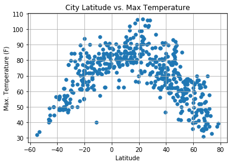
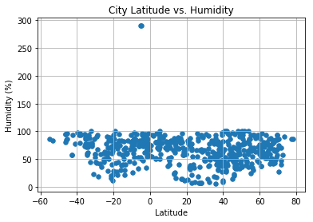
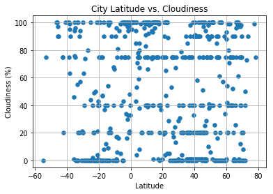
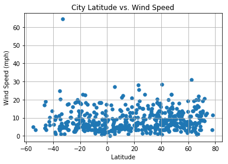

# WeatherPy
----

### Analysis
* As expected, the weather becomes significantly warmer as one approaches the equator (0 Deg. Latitude). More interestingly, however, is the fact that the southern hemisphere tends to be warmer this time of year than the northern hemisphere. This may be due to the tilt of the earth.
* There is no strong relationship between latitude and cloudiness. However, it is interesting to see that a strong band of cities sits at 0, 80, and 100% cloudiness.
* There is no strong relationship between latitude and wind speed. However, in northern hemispheres there is a flurry of cities with over 20 mph of wind.

---

#### Note
* Instructions have been included for each segment. You do not have to follow them exactly, but they are included to help you think through the steps.


```python
# Dependencies and Setup
import matplotlib.pyplot as plt
import pandas as pd
import numpy as np
import requests
import time

# Import API key
import api_keys
print(api_keys)

# Incorporated citipy to determine city based on latitude and longitude
from citipy import citipy

# Output File (CSV)
output_data_file = "output_data/cities.csv"

# Range of latitudes and longitudes
lat_range = (-90, 90)
lng_range = (-180, 180)
```

    <module 'api_keys' from '/Users/bablasawhney/Downloads/GitHub/RUTJER201901DATA3/02-Homework/06-Python-APIs/Instructions/starter_code/api_keys.py'>


## Generate Cities List

### Perform API Calls
* Perform a weather check on each city using a series of successive API calls.
* Include a print log of each city as it'sbeing processed (with the city number and city name).


```python
# List for holding lat_lngs and cities
lat_lngs = []
cities = []

# Create a set of random lat and lng combinations
lats = np.random.uniform(low=-90.000, high=90.000, size=1500)
lngs = np.random.uniform(low=-180.000, high=180.000, size=1500)
lat_lngs = zip(lats, lngs)

# Identify nearest city for each lat, lng combination
for lat_lng in lat_lngs:
    city = citipy.nearest_city(lat_lng[0], lat_lng[1]).city_name
        # Replace spaces with %20 to create url correctly 
    city = city.replace(" ", "%20")
    # If the city is unique, then add it to a our cities list
    if city not in cities:
        cities.append(city)

# Print the city count to confirm sufficient count
len(cities)
cities
```


    ['thompson',
     'geraldton',
     'butaritari',
     'tuatapere',
     'carnarvon',
     'namibe',
     'mataura',
     'sao%20jose%20da%20coroa%20grande',
     'lorengau',
     'mochalishche',
     'ushuaia',
     'tocopilla',
     'taolanaro',
     'dikson',
     'atuona',
     'ponta%20do%20sol',
     'crasna',
     'henties%20bay',
     'heihe',
     'faro',
     'upernavik',
     'jamestown',
     'east%20london',
     'tuktoyaktuk',
     'albany',
     'flin%20flon',
     'nishihara',
     'kamaishi',
     'yellowknife',
     'bredasdorp',
     'illoqqortoormiut',
     'vicuna',
     'port%20alfred',
     'mirabad',
     'jakarta',
     'cape%20town',
     'barrow',
     'tasiilaq',
     'kapit',
     'samusu',
     'barentsburg',
     'dahuk',
     'hermanus',
     'svetlogorsk',
     'hobart',
     'bay%20roberts',
     'busselton',
     'georgetown',
     'avarua',
     'qaqortoq',
     'amderma',
     'katherine',
     'meyungs',
     'cidreira',
     'stornoway',
     'leningradskiy',
     'mazagao',
     'omboue',
     'hastings',
     'salalah',
     'punta%20arenas',
     'bredy',
     'kapaa',
     'abyek',
     'solnechnyy',
     'saint-ambroise',
     'rikitea',
     'san%20quintin',
     'kodiak',
     'arraial%20do%20cabo',
     'tankara',
     'qaanaaq',
     'krasnoturansk',
     'quatre%20cocos',
     'khargone',
     'benghazi',
     'bambous%20virieux',
     'provideniya',
     'mahebourg',
     'puerto%20ayora',
     'pacific%20grove',
     'hilo',
     'ler',
     'volgodonsk',
     'tiksi',
     'umzimvubu',
     'codrington',
     'vaini',
     'kamenka',
     'pochutla',
     'zelezniki',
     'campo%20largo',
     'ribeira%20grande',
     'chokurdakh',
     'baiyin',
     'arlit',
     'ilulissat',
     'aasiaat',
     'akyab',
     'airai',
     'pangai',
     'castro',
     'norman%20wells',
     'hithadhoo',
     'yangambi',
     'sambava',
     'macenta',
     'jiangyou',
     'abonnema',
     'hvide%20sande',
     'deputatskiy',
     'bonavista',
     'vardo',
     'attawapiskat',
     'los%20llanos%20de%20aridane',
     'caconda',
     'kavieng',
     'yatou',
     'pisco',
     'chapais',
     'minggang',
     'ikole',
     'chuy',
     'hobyo',
     'saint-philippe',
     'marcona',
     'san%20patricio',
     'severo-kurilsk',
     'dudinka',
     'bluff',
     'agadir',
     'bima',
     'hornepayne',
     'lanester',
     'jackson',
     'clermont',
     'hihifo',
     'egvekinot',
     'lavrentiya',
     'carahue',
     'fortuna',
     'durango',
     'saldanha',
     'new%20norfolk',
     'sentyabrskiy',
     'adre',
     'hasaki',
     'victoria',
     'tsihombe',
     'lompoc',
     'khonsar',
     'tubuala',
     'taltal',
     'yulara',
     'the%20pas',
     'bemidji',
     'torbay',
     'san%20vicente',
     'erzin',
     'kuche',
     'ahipara',
     'tabuk',
     'saskylakh',
     'souillac',
     'saint-pierre',
     'paita',
     'terrace',
     'ixtapa',
     'faya',
     'marawi',
     'upington',
     'nikolskoye',
     'tomaszow%20mazowiecki',
     'coldwater',
     'vilhena',
     'lazurne',
     'berbera',
     'saratovskaya',
     'pangnirtung',
     'watsa',
     'mys%20shmidta',
     'balaghat',
     'mandalgovi',
     'toppenish',
     'samarai',
     'praia%20da%20vitoria',
     'longyearbyen',
     'naze',
     'garmsar',
     'belmonte',
     'gushikawa',
     'ardakan',
     'san%20martin',
     'isangel',
     'dunedin',
     'poronaysk',
     'constitucion',
     'radenci',
     'kismayo',
     'kirensk',
     'murray%20bridge',
     'sungaipenuh',
     'acarau',
     'caravelas',
     'saint%20george',
     'mar%20del%20plata',
     'foumbot',
     'yangjiang',
     'okhotsk',
     'clyde%20river',
     'bara',
     'khatanga',
     'puerto%20baquerizo%20moreno',
     'yining',
     'shalinskoye',
     'el%20viejo',
     'sugod',
     'yerbogachen',
     'sao%20felix%20do%20xingu',
     'nizhneyansk',
     'manoel%20urbano',
     'mazamari',
     'kushmurun',
     'sitka',
     'valera',
     'esperance',
     'donskoye',
     'urumqi',
     'shakawe',
     'okakarara',
     'yar-sale',
     'cherskiy',
     'srednekolymsk',
     'yokadouma',
     'syamzha',
     'plouzane',
     'jorochito',
     'suez',
     'kununurra',
     'katsuura',
     'agirish',
     'olafsvik',
     'sinyavskoye',
     'kemi',
     'mugla',
     'rio%20grande',
     'maumere',
     'ongandjera',
     'belushya%20guba',
     'songkhla',
     'najran',
     'sur',
     'bethel',
     'mocuba',
     'nanortalik',
     'mutoko',
     'neryungri',
     'bathsheba',
     'ous',
     'qandala',
     'kokopo',
     'bengkulu',
     'richards%20bay',
     'antonina',
     'cahuacan',
     'anadyr',
     'kahului',
     'saleaula',
     'inongo',
     'grand%20gaube',
     'praya',
     'saint%20anthony',
     'port%20elizabeth',
     'camacha',
     'tagusao',
     'shangzhi',
     'camopi',
     'bilibino',
     'luderitz',
     'necochea',
     'sabha',
     'swan%20hill',
     'nuevo%20progreso',
     'uyuni',
     'walvis%20bay',
     'santa%20rosalia',
     'skowhegan',
     'pevek',
     'salta',
     'tautira',
     'buluang',
     'mahadday%20weyne',
     'mount%20isa',
     'ivanteyevka',
     'starokozache',
     'raga',
     'grand%20river%20south%20east',
     'broken%20hill',
     'kieta',
     'barreirinhas',
     'hovd',
     'ipixuna',
     'talnakh',
     'kuna',
     'faanui',
     'buraydah',
     'rehli',
     'meulaboh',
     'san%20buenaventura',
     'hamilton',
     'borgarnes',
     'viligili',
     'poum',
     'kirakira',
     'ambilobe',
     'moranbah',
     'backa%20topola',
     'francistown',
     'puerto%20rondon',
     'sovetskiy',
     'ostrovnoy',
     'seoul',
     'cairns',
     'sri%20aman',
     'algiers',
     'klaksvik',
     'peniche',
     'eureka',
     'nicoya',
     'bac%20lieu',
     'domoni',
     'taoudenni',
     'toro',
     'prokopyevsk',
     'acapulco',
     'koumac',
     'viedma',
     'karakendzha',
     'inhambane',
     'ca%20mau',
     'sobolevo',
     'vostok',
     'san-pedro',
     'capinopolis',
     'da%20nang',
     'petauke',
     'khonuu',
     'adrar',
     'zhaoyang',
     'port%20lincoln',
     'tumannyy',
     'tura',
     'agadez',
     'salinopolis',
     'goderich',
     'zhangye',
     'mendoza',
     'aklavik',
     'alice%20springs',
     'mount%20gambier',
     'vila%20franca%20do%20campo',
     'awbari',
     'ankara',
     'neftcala',
     'ambanja',
     'gravdal',
     'hay%20river',
     'carndonagh',
     'qasigiannguit',
     'naron',
     'sarasota',
     'moose%20factory',
     'ocampo',
     'la%20serena',
     'andradina',
     'palana',
     'dawei',
     'roald',
     'pinyug',
     'atar',
     'cumaribo',
     'baker%20city',
     'basco',
     'makakilo%20city',
     'pemangkat',
     'padang',
     'kaoma',
     'colac',
     'krasnoselkup',
     'uwayl',
     'kangalassy',
     'alamosa',
     'komsomolskiy',
     'batsfjord',
     'la%20rioja',
     'hammerfest',
     'naliya',
     'mosquera',
     'lolua',
     'storm%20lake',
     'chimore',
     'la%20ronge',
     'jiaojiang',
     'maniago',
     'lagoa',
     'sept-iles',
     'vanavara',
     'port%20hardy',
     'rudnyy',
     'nova%20vicosa',
     'iqaluit',
     'colon',
     'anage',
     'monterey',
     'newport',
     'narsaq',
     'bayir',
     'usinsk',
     'tondon',
     'maceio',
     'vila%20velha',
     'boca%20do%20acre',
     'quang%20ngai',
     'kasongo-lunda',
     'boende',
     'mitu',
     'college',
     'arman',
     'bowen',
     'pasighat',
     'ngunguru',
     'arroyo',
     'helong',
     'tarakan',
     'feijo',
     'cordoba',
     'yumen',
     'pombas',
     'northam',
     'kyren',
     'sao%20filipe',
     'bubaque',
     'tazovskiy',
     'sabang',
     'tukrah',
     'coquimbo',
     'volchansk',
     'marion',
     'san%20pedro%20de%20macoris',
     'lubaczow',
     'seydi',
     'bambanglipuro',
     'buariki',
     'torrijos',
     'tucurui',
     'lebu',
     'mahuta',
     'grand-lahou',
     'north%20bend',
     'kokoda',
     'seminole',
     'kontagora',
     'lat%20yao',
     'saint-francois',
     'guaratingueta',
     'mbanza-ngungu',
     'chulman',
     'bandarbeyla',
     'riyadh',
     'sochi',
     'dzidzantun',
     'tailai',
     'coihaique',
     'kamenskoye',
     'narrabri',
     'kaa-khem',
     'alakurtti',
     'karkaralinsk',
     'tual',
     'pitharion',
     'sakakah',
     'lakhtar',
     'visby',
     'vanderhoof',
     'puerto%20narino',
     'sorland',
     'formoso%20do%20araguaia',
     'torrington',
     'black%20river',
     'rosetta',
     'nouakchott',
     'moron',
     'mayor%20pablo%20lagerenza',
     'keningau',
     'te%20anau',
     'puerto%20escondido',
     'antropovo',
     'aykhal',
     'sungairaya',
     'porto%20novo',
     'voh',
     'talara',
     'yuzhno-yeniseyskiy',
     'soyo',
     'saurimo',
     'rabat',
     'beyneu',
     'ciamis',
     'dingle',
     'jahrom',
     'ternate',
     'santa%20fe',
     'asau',
     'mopipi',
     'tortona',
     'musoma',
     'teya',
     'pathein',
     'semirom',
     'syrskoye',
     'dole',
     'cayenne',
     'azar%20shahr',
     'safwah',
     'naryan-mar',
     'dongsheng',
     'mecca',
     'westport',
     'ritchie',
     'carutapera',
     'kenai',
     'west%20sacramento',
     'muravlenko',
     'altamira',
     'ucluelet',
     'port%20blair',
     'batemans%20bay',
     'wilmington',
     'ngukurr',
     'itoman',
     'sokoni',
     'labuhan',
     'palmer',
     'korfovskiy',
     'fairbanks',
     'muros',
     'ambunti',
     'high%20prairie',
     'pingliang',
     'kruisfontein',
     'kabompo',
     'gisborne',
     'sorong',
     'taguatinga',
     'gizo',
     'nhulunbuy',
     'namatanai',
     'kavaratti',
     'jiangkou',
     'vao',
     'kutum',
     'cabo%20san%20lucas',
     'buala',
     'mahibadhoo',
     'alofi',
     'helena',
     'tezu',
     'dubbo',
     'punta%20alta',
     'hofn',
     'fayaoue',
     'ribeira%20brava',
     'cranbrook',
     'ibra',
     'santa%20maria',
     'nakamura',
     'ballsh',
     'oriximina',
     'mayo',
     'santa%20ana',
     'karamadai',
     'carauari',
     'high%20level',
     'sikeston',
     'novomykolayivka',
     'ati',
     'puerto%20colombia']


```python
len(cities)
```


    587


```python
api_key = "HIDDEN"

url = "http://api.openweathermap.org/data/2.5/weather?units=Imperial&APPID=" + api_key

city_name = []
cloudiness = []
country = []
date = []
humidity = []
lat = []
lng = []
max_temp = []
wind_speed = []
record = 1

print(f"Beginning Data Retrieval")
print(f"-------------------------------")


for city in cities:  
    try: 
#         city_url = url + city
#         print(city_url)
        response = requests.get(f"{url}&q={city}").json() 
       
        city_name.append(response["name"])
        cloudiness.append(response["clouds"]["all"])
        country.append(response["sys"]["country"])
        date.append(response["dt"])
        humidity.append(response["main"]["humidity"])
        max_temp.append(response["main"]["temp_max"])
        lat.append(response["coord"]["lat"])
        lng.append(response["coord"]["lon"])
        wind_speed.append(response["wind"]["speed"])
        city_record = response["name"]
        print(f"Processing Record {record} | {city_record}")
        print(f"{url}&q={city}")
        record= record + 1
        time.sleep(1.00)
        
    
    except:
        print("City not found. Skipping...")
    continue
```

    Beginning Data Retrieval
    -------------------------------
    Processing Record 1 | Thompson
    http://api.openweathermap.org/data/2.5/weather?units=Imperial&APPID=23ae0640048b80fa8931682445559061&q=thompson
    Processing Record 2 | Geraldton
    http://api.openweathermap.org/data/2.5/weather?units=Imperial&APPID=23ae0640048b80fa8931682445559061&q=geraldton
    Processing Record 3 | Butaritari
    http://api.openweathermap.org/data/2.5/weather?units=Imperial&APPID=23ae0640048b80fa8931682445559061&q=butaritari
    Processing Record 4 | Tuatapere
    http://api.openweathermap.org/data/2.5/weather?units=Imperial&APPID=23ae0640048b80fa8931682445559061&q=tuatapere
    Processing Record 5 | Carnarvon
    http://api.openweathermap.org/data/2.5/weather?units=Imperial&APPID=23ae0640048b80fa8931682445559061&q=carnarvon
    Processing Record 6 | Namibe
    http://api.openweathermap.org/data/2.5/weather?units=Imperial&APPID=23ae0640048b80fa8931682445559061&q=namibe
    Processing Record 7 | Mataura
    http://api.openweathermap.org/data/2.5/weather?units=Imperial&APPID=23ae0640048b80fa8931682445559061&q=mataura
    Processing Record 8 | Sao Jose da Coroa Grande
    http://api.openweathermap.org/data/2.5/weather?units=Imperial&APPID=23ae0640048b80fa8931682445559061&q=sao%20jose%20da%20coroa%20grande
    Processing Record 9 | Lorengau
    http://api.openweathermap.org/data/2.5/weather?units=Imperial&APPID=23ae0640048b80fa8931682445559061&q=lorengau
    Processing Record 10 | Mochalishche
    http://api.openweathermap.org/data/2.5/weather?units=Imperial&APPID=23ae0640048b80fa8931682445559061&q=mochalishche
    Processing Record 11 | Ushuaia
    http://api.openweathermap.org/data/2.5/weather?units=Imperial&APPID=23ae0640048b80fa8931682445559061&q=ushuaia
    Processing Record 12 | Tocopilla
    http://api.openweathermap.org/data/2.5/weather?units=Imperial&APPID=23ae0640048b80fa8931682445559061&q=tocopilla
    City not found. Skipping...
    Processing Record 13 | Dikson
    http://api.openweathermap.org/data/2.5/weather?units=Imperial&APPID=23ae0640048b80fa8931682445559061&q=dikson
    Processing Record 14 | Atuona
    http://api.openweathermap.org/data/2.5/weather?units=Imperial&APPID=23ae0640048b80fa8931682445559061&q=atuona
    Processing Record 15 | Ponta do Sol
    http://api.openweathermap.org/data/2.5/weather?units=Imperial&APPID=23ae0640048b80fa8931682445559061&q=ponta%20do%20sol
    Processing Record 16 | Crasna
    http://api.openweathermap.org/data/2.5/weather?units=Imperial&APPID=23ae0640048b80fa8931682445559061&q=crasna
    Processing Record 17 | Henties Bay
    http://api.openweathermap.org/data/2.5/weather?units=Imperial&APPID=23ae0640048b80fa8931682445559061&q=henties%20bay
    Processing Record 18 | Heihe
    http://api.openweathermap.org/data/2.5/weather?units=Imperial&APPID=23ae0640048b80fa8931682445559061&q=heihe
    Processing Record 19 | Faro
    http://api.openweathermap.org/data/2.5/weather?units=Imperial&APPID=23ae0640048b80fa8931682445559061&q=faro
    Processing Record 20 | Upernavik
    http://api.openweathermap.org/data/2.5/weather?units=Imperial&APPID=23ae0640048b80fa8931682445559061&q=upernavik
    Processing Record 21 | Jamestown
    http://api.openweathermap.org/data/2.5/weather?units=Imperial&APPID=23ae0640048b80fa8931682445559061&q=jamestown
    Processing Record 22 | East London
    http://api.openweathermap.org/data/2.5/weather?units=Imperial&APPID=23ae0640048b80fa8931682445559061&q=east%20london
    Processing Record 23 | Tuktoyaktuk
    http://api.openweathermap.org/data/2.5/weather?units=Imperial&APPID=23ae0640048b80fa8931682445559061&q=tuktoyaktuk
    Processing Record 24 | Albany
    http://api.openweathermap.org/data/2.5/weather?units=Imperial&APPID=23ae0640048b80fa8931682445559061&q=albany
    Processing Record 25 | Flin Flon
    http://api.openweathermap.org/data/2.5/weather?units=Imperial&APPID=23ae0640048b80fa8931682445559061&q=flin%20flon
    Processing Record 26 | Nishihara
    http://api.openweathermap.org/data/2.5/weather?units=Imperial&APPID=23ae0640048b80fa8931682445559061&q=nishihara
    Processing Record 27 | Kamaishi
    http://api.openweathermap.org/data/2.5/weather?units=Imperial&APPID=23ae0640048b80fa8931682445559061&q=kamaishi
    Processing Record 28 | Yellowknife
    http://api.openweathermap.org/data/2.5/weather?units=Imperial&APPID=23ae0640048b80fa8931682445559061&q=yellowknife
    Processing Record 29 | Bredasdorp
    http://api.openweathermap.org/data/2.5/weather?units=Imperial&APPID=23ae0640048b80fa8931682445559061&q=bredasdorp
    City not found. Skipping...
    City not found. Skipping...
    Processing Record 30 | Port Alfred
    http://api.openweathermap.org/data/2.5/weather?units=Imperial&APPID=23ae0640048b80fa8931682445559061&q=port%20alfred
    Processing Record 31 | Mirabad
    http://api.openweathermap.org/data/2.5/weather?units=Imperial&APPID=23ae0640048b80fa8931682445559061&q=mirabad
    Processing Record 32 | Jakarta
    http://api.openweathermap.org/data/2.5/weather?units=Imperial&APPID=23ae0640048b80fa8931682445559061&q=jakarta
    Processing Record 33 | Cape Town
    http://api.openweathermap.org/data/2.5/weather?units=Imperial&APPID=23ae0640048b80fa8931682445559061&q=cape%20town
    Processing Record 34 | Barrow
    http://api.openweathermap.org/data/2.5/weather?units=Imperial&APPID=23ae0640048b80fa8931682445559061&q=barrow
    Processing Record 35 | Tasiilaq
    http://api.openweathermap.org/data/2.5/weather?units=Imperial&APPID=23ae0640048b80fa8931682445559061&q=tasiilaq
    Processing Record 36 | Kapit
    http://api.openweathermap.org/data/2.5/weather?units=Imperial&APPID=23ae0640048b80fa8931682445559061&q=kapit
    City not found. Skipping...
    City not found. Skipping...
    City not found. Skipping...
    Processing Record 37 | Hermanus
    http://api.openweathermap.org/data/2.5/weather?units=Imperial&APPID=23ae0640048b80fa8931682445559061&q=hermanus
    Processing Record 38 | Svetlogorsk
    http://api.openweathermap.org/data/2.5/weather?units=Imperial&APPID=23ae0640048b80fa8931682445559061&q=svetlogorsk
    Processing Record 39 | Hobart
    http://api.openweathermap.org/data/2.5/weather?units=Imperial&APPID=23ae0640048b80fa8931682445559061&q=hobart
    Processing Record 40 | Bay Roberts
    http://api.openweathermap.org/data/2.5/weather?units=Imperial&APPID=23ae0640048b80fa8931682445559061&q=bay%20roberts
    Processing Record 41 | Busselton
    http://api.openweathermap.org/data/2.5/weather?units=Imperial&APPID=23ae0640048b80fa8931682445559061&q=busselton
    Processing Record 42 | Georgetown
    http://api.openweathermap.org/data/2.5/weather?units=Imperial&APPID=23ae0640048b80fa8931682445559061&q=georgetown
    Processing Record 43 | Avarua
    http://api.openweathermap.org/data/2.5/weather?units=Imperial&APPID=23ae0640048b80fa8931682445559061&q=avarua
    Processing Record 44 | Qaqortoq
    http://api.openweathermap.org/data/2.5/weather?units=Imperial&APPID=23ae0640048b80fa8931682445559061&q=qaqortoq
    City not found. Skipping...
    Processing Record 45 | Katherine
    http://api.openweathermap.org/data/2.5/weather?units=Imperial&APPID=23ae0640048b80fa8931682445559061&q=katherine
    City not found. Skipping...
    Processing Record 46 | Cidreira
    http://api.openweathermap.org/data/2.5/weather?units=Imperial&APPID=23ae0640048b80fa8931682445559061&q=cidreira
    City not found. Skipping...
    Processing Record 47 | Leningradskiy
    http://api.openweathermap.org/data/2.5/weather?units=Imperial&APPID=23ae0640048b80fa8931682445559061&q=leningradskiy
    Processing Record 48 | Mazagao
    http://api.openweathermap.org/data/2.5/weather?units=Imperial&APPID=23ae0640048b80fa8931682445559061&q=mazagao
    Processing Record 49 | Omboue
    http://api.openweathermap.org/data/2.5/weather?units=Imperial&APPID=23ae0640048b80fa8931682445559061&q=omboue
    Processing Record 50 | Hastings
    http://api.openweathermap.org/data/2.5/weather?units=Imperial&APPID=23ae0640048b80fa8931682445559061&q=hastings
    Processing Record 51 | Salalah
    http://api.openweathermap.org/data/2.5/weather?units=Imperial&APPID=23ae0640048b80fa8931682445559061&q=salalah
    Processing Record 52 | Punta Arenas
    http://api.openweathermap.org/data/2.5/weather?units=Imperial&APPID=23ae0640048b80fa8931682445559061&q=punta%20arenas
    Processing Record 53 | Bredy
    http://api.openweathermap.org/data/2.5/weather?units=Imperial&APPID=23ae0640048b80fa8931682445559061&q=bredy
    Processing Record 54 | Kapaa
    http://api.openweathermap.org/data/2.5/weather?units=Imperial&APPID=23ae0640048b80fa8931682445559061&q=kapaa
    Processing Record 55 | Abyek
    http://api.openweathermap.org/data/2.5/weather?units=Imperial&APPID=23ae0640048b80fa8931682445559061&q=abyek
    Processing Record 56 | Solnechnyy
    http://api.openweathermap.org/data/2.5/weather?units=Imperial&APPID=23ae0640048b80fa8931682445559061&q=solnechnyy
    Processing Record 57 | Saint-Ambroise
    http://api.openweathermap.org/data/2.5/weather?units=Imperial&APPID=23ae0640048b80fa8931682445559061&q=saint-ambroise
    Processing Record 58 | Rikitea
    http://api.openweathermap.org/data/2.5/weather?units=Imperial&APPID=23ae0640048b80fa8931682445559061&q=rikitea
    Processing Record 59 | San Quintin
    http://api.openweathermap.org/data/2.5/weather?units=Imperial&APPID=23ae0640048b80fa8931682445559061&q=san%20quintin
    Processing Record 60 | Kodiak
    http://api.openweathermap.org/data/2.5/weather?units=Imperial&APPID=23ae0640048b80fa8931682445559061&q=kodiak
    Processing Record 61 | Arraial do Cabo
    http://api.openweathermap.org/data/2.5/weather?units=Imperial&APPID=23ae0640048b80fa8931682445559061&q=arraial%20do%20cabo
    Processing Record 62 | Tankara
    http://api.openweathermap.org/data/2.5/weather?units=Imperial&APPID=23ae0640048b80fa8931682445559061&q=tankara
    Processing Record 63 | Qaanaaq
    http://api.openweathermap.org/data/2.5/weather?units=Imperial&APPID=23ae0640048b80fa8931682445559061&q=qaanaaq
    Processing Record 64 | Krasnoturansk
    http://api.openweathermap.org/data/2.5/weather?units=Imperial&APPID=23ae0640048b80fa8931682445559061&q=krasnoturansk
    Processing Record 65 | Quatre Cocos
    http://api.openweathermap.org/data/2.5/weather?units=Imperial&APPID=23ae0640048b80fa8931682445559061&q=quatre%20cocos
    Processing Record 66 | Khargone
    http://api.openweathermap.org/data/2.5/weather?units=Imperial&APPID=23ae0640048b80fa8931682445559061&q=khargone
    Processing Record 67 | Benghazi
    http://api.openweathermap.org/data/2.5/weather?units=Imperial&APPID=23ae0640048b80fa8931682445559061&q=benghazi
    Processing Record 68 | Bambous Virieux
    http://api.openweathermap.org/data/2.5/weather?units=Imperial&APPID=23ae0640048b80fa8931682445559061&q=bambous%20virieux
    Processing Record 69 | Provideniya
    http://api.openweathermap.org/data/2.5/weather?units=Imperial&APPID=23ae0640048b80fa8931682445559061&q=provideniya
    Processing Record 70 | Mahebourg
    http://api.openweathermap.org/data/2.5/weather?units=Imperial&APPID=23ae0640048b80fa8931682445559061&q=mahebourg
    Processing Record 71 | Puerto Ayora
    http://api.openweathermap.org/data/2.5/weather?units=Imperial&APPID=23ae0640048b80fa8931682445559061&q=puerto%20ayora
    Processing Record 72 | Pacific Grove
    http://api.openweathermap.org/data/2.5/weather?units=Imperial&APPID=23ae0640048b80fa8931682445559061&q=pacific%20grove
    Processing Record 73 | Hilo
    http://api.openweathermap.org/data/2.5/weather?units=Imperial&APPID=23ae0640048b80fa8931682445559061&q=hilo
    Processing Record 74 | Ler
    http://api.openweathermap.org/data/2.5/weather?units=Imperial&APPID=23ae0640048b80fa8931682445559061&q=ler
    Processing Record 75 | Volgodonsk
    http://api.openweathermap.org/data/2.5/weather?units=Imperial&APPID=23ae0640048b80fa8931682445559061&q=volgodonsk
    Processing Record 76 | Tiksi
    http://api.openweathermap.org/data/2.5/weather?units=Imperial&APPID=23ae0640048b80fa8931682445559061&q=tiksi
    City not found. Skipping...
    Processing Record 77 | Codrington
    http://api.openweathermap.org/data/2.5/weather?units=Imperial&APPID=23ae0640048b80fa8931682445559061&q=codrington
    Processing Record 78 | Vaini
    http://api.openweathermap.org/data/2.5/weather?units=Imperial&APPID=23ae0640048b80fa8931682445559061&q=vaini
    Processing Record 79 | Kamenka
    http://api.openweathermap.org/data/2.5/weather?units=Imperial&APPID=23ae0640048b80fa8931682445559061&q=kamenka
    Processing Record 80 | Pochutla
    http://api.openweathermap.org/data/2.5/weather?units=Imperial&APPID=23ae0640048b80fa8931682445559061&q=pochutla
    Processing Record 81 | Zelezniki
    http://api.openweathermap.org/data/2.5/weather?units=Imperial&APPID=23ae0640048b80fa8931682445559061&q=zelezniki
    Processing Record 82 | Campo Largo
    http://api.openweathermap.org/data/2.5/weather?units=Imperial&APPID=23ae0640048b80fa8931682445559061&q=campo%20largo
    Processing Record 83 | Ribeira Grande
    http://api.openweathermap.org/data/2.5/weather?units=Imperial&APPID=23ae0640048b80fa8931682445559061&q=ribeira%20grande
    Processing Record 84 | Chokurdakh
    http://api.openweathermap.org/data/2.5/weather?units=Imperial&APPID=23ae0640048b80fa8931682445559061&q=chokurdakh
    Processing Record 85 | Baiyin
    http://api.openweathermap.org/data/2.5/weather?units=Imperial&APPID=23ae0640048b80fa8931682445559061&q=baiyin
    Processing Record 86 | Arlit
    http://api.openweathermap.org/data/2.5/weather?units=Imperial&APPID=23ae0640048b80fa8931682445559061&q=arlit
    Processing Record 87 | Ilulissat
    http://api.openweathermap.org/data/2.5/weather?units=Imperial&APPID=23ae0640048b80fa8931682445559061&q=ilulissat
    Processing Record 88 | Aasiaat
    http://api.openweathermap.org/data/2.5/weather?units=Imperial&APPID=23ae0640048b80fa8931682445559061&q=aasiaat
    City not found. Skipping...
    Processing Record 89 | Airai
    http://api.openweathermap.org/data/2.5/weather?units=Imperial&APPID=23ae0640048b80fa8931682445559061&q=airai
    Processing Record 90 | Pangai
    http://api.openweathermap.org/data/2.5/weather?units=Imperial&APPID=23ae0640048b80fa8931682445559061&q=pangai
    Processing Record 91 | Castro
    http://api.openweathermap.org/data/2.5/weather?units=Imperial&APPID=23ae0640048b80fa8931682445559061&q=castro
    Processing Record 92 | Norman Wells
    http://api.openweathermap.org/data/2.5/weather?units=Imperial&APPID=23ae0640048b80fa8931682445559061&q=norman%20wells
    Processing Record 93 | Hithadhoo
    http://api.openweathermap.org/data/2.5/weather?units=Imperial&APPID=23ae0640048b80fa8931682445559061&q=hithadhoo
    Processing Record 94 | Yangambi
    http://api.openweathermap.org/data/2.5/weather?units=Imperial&APPID=23ae0640048b80fa8931682445559061&q=yangambi
    Processing Record 95 | Sambava
    http://api.openweathermap.org/data/2.5/weather?units=Imperial&APPID=23ae0640048b80fa8931682445559061&q=sambava
    Processing Record 96 | Macenta
    http://api.openweathermap.org/data/2.5/weather?units=Imperial&APPID=23ae0640048b80fa8931682445559061&q=macenta
    Processing Record 97 | Jiangyou
    http://api.openweathermap.org/data/2.5/weather?units=Imperial&APPID=23ae0640048b80fa8931682445559061&q=jiangyou
    Processing Record 98 | Abonnema
    http://api.openweathermap.org/data/2.5/weather?units=Imperial&APPID=23ae0640048b80fa8931682445559061&q=abonnema
    Processing Record 99 | Hvide Sande
    http://api.openweathermap.org/data/2.5/weather?units=Imperial&APPID=23ae0640048b80fa8931682445559061&q=hvide%20sande
    Processing Record 100 | Deputatskiy
    http://api.openweathermap.org/data/2.5/weather?units=Imperial&APPID=23ae0640048b80fa8931682445559061&q=deputatskiy
    Processing Record 101 | Bonavista
    http://api.openweathermap.org/data/2.5/weather?units=Imperial&APPID=23ae0640048b80fa8931682445559061&q=bonavista
    Processing Record 102 | Vardo
    http://api.openweathermap.org/data/2.5/weather?units=Imperial&APPID=23ae0640048b80fa8931682445559061&q=vardo
    City not found. Skipping...
    Processing Record 103 | Los Llanos de Aridane
    http://api.openweathermap.org/data/2.5/weather?units=Imperial&APPID=23ae0640048b80fa8931682445559061&q=los%20llanos%20de%20aridane
    Processing Record 104 | Caconda
    http://api.openweathermap.org/data/2.5/weather?units=Imperial&APPID=23ae0640048b80fa8931682445559061&q=caconda
    Processing Record 105 | Kavieng
    http://api.openweathermap.org/data/2.5/weather?units=Imperial&APPID=23ae0640048b80fa8931682445559061&q=kavieng
    Processing Record 106 | Yatou
    http://api.openweathermap.org/data/2.5/weather?units=Imperial&APPID=23ae0640048b80fa8931682445559061&q=yatou
    Processing Record 107 | Pisco
    http://api.openweathermap.org/data/2.5/weather?units=Imperial&APPID=23ae0640048b80fa8931682445559061&q=pisco
    Processing Record 108 | Chapais
    http://api.openweathermap.org/data/2.5/weather?units=Imperial&APPID=23ae0640048b80fa8931682445559061&q=chapais
    Processing Record 109 | Minggang
    http://api.openweathermap.org/data/2.5/weather?units=Imperial&APPID=23ae0640048b80fa8931682445559061&q=minggang
    City not found. Skipping...
    Processing Record 110 | Chuy
    http://api.openweathermap.org/data/2.5/weather?units=Imperial&APPID=23ae0640048b80fa8931682445559061&q=chuy
    Processing Record 111 | Hobyo
    http://api.openweathermap.org/data/2.5/weather?units=Imperial&APPID=23ae0640048b80fa8931682445559061&q=hobyo
    Processing Record 112 | Saint-Philippe
    http://api.openweathermap.org/data/2.5/weather?units=Imperial&APPID=23ae0640048b80fa8931682445559061&q=saint-philippe
    City not found. Skipping...
    Processing Record 113 | San Patricio
    http://api.openweathermap.org/data/2.5/weather?units=Imperial&APPID=23ae0640048b80fa8931682445559061&q=san%20patricio
    Processing Record 114 | Severo-Kurilsk
    http://api.openweathermap.org/data/2.5/weather?units=Imperial&APPID=23ae0640048b80fa8931682445559061&q=severo-kurilsk
    Processing Record 115 | Dudinka
    http://api.openweathermap.org/data/2.5/weather?units=Imperial&APPID=23ae0640048b80fa8931682445559061&q=dudinka
    Processing Record 116 | Bluff
    http://api.openweathermap.org/data/2.5/weather?units=Imperial&APPID=23ae0640048b80fa8931682445559061&q=bluff
    Processing Record 117 | Agadir
    http://api.openweathermap.org/data/2.5/weather?units=Imperial&APPID=23ae0640048b80fa8931682445559061&q=agadir
    Processing Record 118 | Bima
    http://api.openweathermap.org/data/2.5/weather?units=Imperial&APPID=23ae0640048b80fa8931682445559061&q=bima
    Processing Record 119 | Hornepayne
    http://api.openweathermap.org/data/2.5/weather?units=Imperial&APPID=23ae0640048b80fa8931682445559061&q=hornepayne
    Processing Record 120 | Lanester
    http://api.openweathermap.org/data/2.5/weather?units=Imperial&APPID=23ae0640048b80fa8931682445559061&q=lanester
    Processing Record 121 | Jackson
    http://api.openweathermap.org/data/2.5/weather?units=Imperial&APPID=23ae0640048b80fa8931682445559061&q=jackson
    Processing Record 122 | Clermont
    http://api.openweathermap.org/data/2.5/weather?units=Imperial&APPID=23ae0640048b80fa8931682445559061&q=clermont
    City not found. Skipping...
    Processing Record 123 | Egvekinot
    http://api.openweathermap.org/data/2.5/weather?units=Imperial&APPID=23ae0640048b80fa8931682445559061&q=egvekinot
    Processing Record 124 | Lavrentiya
    http://api.openweathermap.org/data/2.5/weather?units=Imperial&APPID=23ae0640048b80fa8931682445559061&q=lavrentiya
    Processing Record 125 | Carahue
    http://api.openweathermap.org/data/2.5/weather?units=Imperial&APPID=23ae0640048b80fa8931682445559061&q=carahue
    Processing Record 126 | Fortuna
    http://api.openweathermap.org/data/2.5/weather?units=Imperial&APPID=23ae0640048b80fa8931682445559061&q=fortuna
    Processing Record 127 | Durango
    http://api.openweathermap.org/data/2.5/weather?units=Imperial&APPID=23ae0640048b80fa8931682445559061&q=durango
    Processing Record 128 | Saldanha
    http://api.openweathermap.org/data/2.5/weather?units=Imperial&APPID=23ae0640048b80fa8931682445559061&q=saldanha
    Processing Record 129 | New Norfolk
    http://api.openweathermap.org/data/2.5/weather?units=Imperial&APPID=23ae0640048b80fa8931682445559061&q=new%20norfolk
    City not found. Skipping...
    Processing Record 130 | Adre
    http://api.openweathermap.org/data/2.5/weather?units=Imperial&APPID=23ae0640048b80fa8931682445559061&q=adre
    Processing Record 131 | Hasaki
    http://api.openweathermap.org/data/2.5/weather?units=Imperial&APPID=23ae0640048b80fa8931682445559061&q=hasaki
    Processing Record 132 | Victoria
    http://api.openweathermap.org/data/2.5/weather?units=Imperial&APPID=23ae0640048b80fa8931682445559061&q=victoria
    City not found. Skipping...
    Processing Record 133 | Lompoc
    http://api.openweathermap.org/data/2.5/weather?units=Imperial&APPID=23ae0640048b80fa8931682445559061&q=lompoc
    City not found. Skipping...
    Processing Record 134 | Tubuala
    http://api.openweathermap.org/data/2.5/weather?units=Imperial&APPID=23ae0640048b80fa8931682445559061&q=tubuala
    Processing Record 135 | Taltal
    http://api.openweathermap.org/data/2.5/weather?units=Imperial&APPID=23ae0640048b80fa8931682445559061&q=taltal
    Processing Record 136 | Yulara
    http://api.openweathermap.org/data/2.5/weather?units=Imperial&APPID=23ae0640048b80fa8931682445559061&q=yulara
    Processing Record 137 | The Pas
    http://api.openweathermap.org/data/2.5/weather?units=Imperial&APPID=23ae0640048b80fa8931682445559061&q=the%20pas
    Processing Record 138 | Bemidji
    http://api.openweathermap.org/data/2.5/weather?units=Imperial&APPID=23ae0640048b80fa8931682445559061&q=bemidji
    Processing Record 139 | Torbay
    http://api.openweathermap.org/data/2.5/weather?units=Imperial&APPID=23ae0640048b80fa8931682445559061&q=torbay
    Processing Record 140 | San Vicente
    http://api.openweathermap.org/data/2.5/weather?units=Imperial&APPID=23ae0640048b80fa8931682445559061&q=san%20vicente
    Processing Record 141 | Erzin
    http://api.openweathermap.org/data/2.5/weather?units=Imperial&APPID=23ae0640048b80fa8931682445559061&q=erzin
    City not found. Skipping...
    Processing Record 142 | Ahipara
    http://api.openweathermap.org/data/2.5/weather?units=Imperial&APPID=23ae0640048b80fa8931682445559061&q=ahipara
    Processing Record 143 | Tabuk
    http://api.openweathermap.org/data/2.5/weather?units=Imperial&APPID=23ae0640048b80fa8931682445559061&q=tabuk
    Processing Record 144 | Saskylakh
    http://api.openweathermap.org/data/2.5/weather?units=Imperial&APPID=23ae0640048b80fa8931682445559061&q=saskylakh
    Processing Record 145 | Souillac
    http://api.openweathermap.org/data/2.5/weather?units=Imperial&APPID=23ae0640048b80fa8931682445559061&q=souillac
    Processing Record 146 | Saint-Pierre
    http://api.openweathermap.org/data/2.5/weather?units=Imperial&APPID=23ae0640048b80fa8931682445559061&q=saint-pierre
    Processing Record 147 | Paita
    http://api.openweathermap.org/data/2.5/weather?units=Imperial&APPID=23ae0640048b80fa8931682445559061&q=paita
    Processing Record 148 | Terrace
    http://api.openweathermap.org/data/2.5/weather?units=Imperial&APPID=23ae0640048b80fa8931682445559061&q=terrace
    Processing Record 149 | Ixtapa
    http://api.openweathermap.org/data/2.5/weather?units=Imperial&APPID=23ae0640048b80fa8931682445559061&q=ixtapa
    Processing Record 150 | Faya
    http://api.openweathermap.org/data/2.5/weather?units=Imperial&APPID=23ae0640048b80fa8931682445559061&q=faya
    Processing Record 151 | Marawi
    http://api.openweathermap.org/data/2.5/weather?units=Imperial&APPID=23ae0640048b80fa8931682445559061&q=marawi
    Processing Record 152 | Upington
    http://api.openweathermap.org/data/2.5/weather?units=Imperial&APPID=23ae0640048b80fa8931682445559061&q=upington
    Processing Record 153 | Nikolskoye
    http://api.openweathermap.org/data/2.5/weather?units=Imperial&APPID=23ae0640048b80fa8931682445559061&q=nikolskoye
    Processing Record 154 | Tomaszow Mazowiecki
    http://api.openweathermap.org/data/2.5/weather?units=Imperial&APPID=23ae0640048b80fa8931682445559061&q=tomaszow%20mazowiecki
    Processing Record 155 | Coldwater
    http://api.openweathermap.org/data/2.5/weather?units=Imperial&APPID=23ae0640048b80fa8931682445559061&q=coldwater
    Processing Record 156 | Vilhena
    http://api.openweathermap.org/data/2.5/weather?units=Imperial&APPID=23ae0640048b80fa8931682445559061&q=vilhena
    Processing Record 157 | Lazurne
    http://api.openweathermap.org/data/2.5/weather?units=Imperial&APPID=23ae0640048b80fa8931682445559061&q=lazurne
    City not found. Skipping...
    Processing Record 158 | Saratovskaya
    http://api.openweathermap.org/data/2.5/weather?units=Imperial&APPID=23ae0640048b80fa8931682445559061&q=saratovskaya
    Processing Record 159 | Pangnirtung
    http://api.openweathermap.org/data/2.5/weather?units=Imperial&APPID=23ae0640048b80fa8931682445559061&q=pangnirtung
    Processing Record 160 | Watsa
    http://api.openweathermap.org/data/2.5/weather?units=Imperial&APPID=23ae0640048b80fa8931682445559061&q=watsa
    City not found. Skipping...
    Processing Record 161 | Balaghat
    http://api.openweathermap.org/data/2.5/weather?units=Imperial&APPID=23ae0640048b80fa8931682445559061&q=balaghat
    Processing Record 162 | Mandalgovi
    http://api.openweathermap.org/data/2.5/weather?units=Imperial&APPID=23ae0640048b80fa8931682445559061&q=mandalgovi
    Processing Record 163 | Toppenish
    http://api.openweathermap.org/data/2.5/weather?units=Imperial&APPID=23ae0640048b80fa8931682445559061&q=toppenish
    Processing Record 164 | Samarai
    http://api.openweathermap.org/data/2.5/weather?units=Imperial&APPID=23ae0640048b80fa8931682445559061&q=samarai
    Processing Record 165 | Praia da Vitoria
    http://api.openweathermap.org/data/2.5/weather?units=Imperial&APPID=23ae0640048b80fa8931682445559061&q=praia%20da%20vitoria
    Processing Record 166 | Longyearbyen
    http://api.openweathermap.org/data/2.5/weather?units=Imperial&APPID=23ae0640048b80fa8931682445559061&q=longyearbyen
    Processing Record 167 | Naze
    http://api.openweathermap.org/data/2.5/weather?units=Imperial&APPID=23ae0640048b80fa8931682445559061&q=naze
    Processing Record 168 | Garmsar
    http://api.openweathermap.org/data/2.5/weather?units=Imperial&APPID=23ae0640048b80fa8931682445559061&q=garmsar
    Processing Record 169 | Belmonte
    http://api.openweathermap.org/data/2.5/weather?units=Imperial&APPID=23ae0640048b80fa8931682445559061&q=belmonte
    Processing Record 170 | Gushikawa
    http://api.openweathermap.org/data/2.5/weather?units=Imperial&APPID=23ae0640048b80fa8931682445559061&q=gushikawa
    Processing Record 171 | Ardakan
    http://api.openweathermap.org/data/2.5/weather?units=Imperial&APPID=23ae0640048b80fa8931682445559061&q=ardakan
    Processing Record 172 | San Martin
    http://api.openweathermap.org/data/2.5/weather?units=Imperial&APPID=23ae0640048b80fa8931682445559061&q=san%20martin
    Processing Record 173 | Isangel
    http://api.openweathermap.org/data/2.5/weather?units=Imperial&APPID=23ae0640048b80fa8931682445559061&q=isangel
    Processing Record 174 | Dunedin
    http://api.openweathermap.org/data/2.5/weather?units=Imperial&APPID=23ae0640048b80fa8931682445559061&q=dunedin
    Processing Record 175 | Poronaysk
    http://api.openweathermap.org/data/2.5/weather?units=Imperial&APPID=23ae0640048b80fa8931682445559061&q=poronaysk
    Processing Record 176 | Constitucion
    http://api.openweathermap.org/data/2.5/weather?units=Imperial&APPID=23ae0640048b80fa8931682445559061&q=constitucion
    Processing Record 177 | Radenci
    http://api.openweathermap.org/data/2.5/weather?units=Imperial&APPID=23ae0640048b80fa8931682445559061&q=radenci
    City not found. Skipping...
    Processing Record 178 | Kirensk
    http://api.openweathermap.org/data/2.5/weather?units=Imperial&APPID=23ae0640048b80fa8931682445559061&q=kirensk
    Processing Record 179 | Murray Bridge
    http://api.openweathermap.org/data/2.5/weather?units=Imperial&APPID=23ae0640048b80fa8931682445559061&q=murray%20bridge
    Processing Record 180 | Sungaipenuh
    http://api.openweathermap.org/data/2.5/weather?units=Imperial&APPID=23ae0640048b80fa8931682445559061&q=sungaipenuh
    City not found. Skipping...
    Processing Record 181 | Caravelas
    http://api.openweathermap.org/data/2.5/weather?units=Imperial&APPID=23ae0640048b80fa8931682445559061&q=caravelas
    Processing Record 182 | Saint George
    http://api.openweathermap.org/data/2.5/weather?units=Imperial&APPID=23ae0640048b80fa8931682445559061&q=saint%20george
    Processing Record 183 | Mar del Plata
    http://api.openweathermap.org/data/2.5/weather?units=Imperial&APPID=23ae0640048b80fa8931682445559061&q=mar%20del%20plata
    Processing Record 184 | Foumbot
    http://api.openweathermap.org/data/2.5/weather?units=Imperial&APPID=23ae0640048b80fa8931682445559061&q=foumbot
    Processing Record 185 | Yangjiang
    http://api.openweathermap.org/data/2.5/weather?units=Imperial&APPID=23ae0640048b80fa8931682445559061&q=yangjiang
    Processing Record 186 | Okhotsk
    http://api.openweathermap.org/data/2.5/weather?units=Imperial&APPID=23ae0640048b80fa8931682445559061&q=okhotsk
    Processing Record 187 | Clyde River
    http://api.openweathermap.org/data/2.5/weather?units=Imperial&APPID=23ae0640048b80fa8931682445559061&q=clyde%20river
    Processing Record 188 | Bara
    http://api.openweathermap.org/data/2.5/weather?units=Imperial&APPID=23ae0640048b80fa8931682445559061&q=bara
    Processing Record 189 | Khatanga
    http://api.openweathermap.org/data/2.5/weather?units=Imperial&APPID=23ae0640048b80fa8931682445559061&q=khatanga
    Processing Record 190 | Puerto Baquerizo Moreno
    http://api.openweathermap.org/data/2.5/weather?units=Imperial&APPID=23ae0640048b80fa8931682445559061&q=puerto%20baquerizo%20moreno
    Processing Record 191 | Yining
    http://api.openweathermap.org/data/2.5/weather?units=Imperial&APPID=23ae0640048b80fa8931682445559061&q=yining
    Processing Record 192 | Shalinskoye
    http://api.openweathermap.org/data/2.5/weather?units=Imperial&APPID=23ae0640048b80fa8931682445559061&q=shalinskoye
    Processing Record 193 | El Viejo
    http://api.openweathermap.org/data/2.5/weather?units=Imperial&APPID=23ae0640048b80fa8931682445559061&q=el%20viejo
    Processing Record 194 | Sugod
    http://api.openweathermap.org/data/2.5/weather?units=Imperial&APPID=23ae0640048b80fa8931682445559061&q=sugod
    Processing Record 195 | Yerbogachen
    http://api.openweathermap.org/data/2.5/weather?units=Imperial&APPID=23ae0640048b80fa8931682445559061&q=yerbogachen
    Processing Record 196 | Sao Felix do Xingu
    http://api.openweathermap.org/data/2.5/weather?units=Imperial&APPID=23ae0640048b80fa8931682445559061&q=sao%20felix%20do%20xingu
    City not found. Skipping...
    Processing Record 197 | Manoel Urbano
    http://api.openweathermap.org/data/2.5/weather?units=Imperial&APPID=23ae0640048b80fa8931682445559061&q=manoel%20urbano
    Processing Record 198 | Mazamari
    http://api.openweathermap.org/data/2.5/weather?units=Imperial&APPID=23ae0640048b80fa8931682445559061&q=mazamari
    City not found. Skipping...
    Processing Record 199 | Sitka
    http://api.openweathermap.org/data/2.5/weather?units=Imperial&APPID=23ae0640048b80fa8931682445559061&q=sitka
    Processing Record 200 | Valera
    http://api.openweathermap.org/data/2.5/weather?units=Imperial&APPID=23ae0640048b80fa8931682445559061&q=valera
    Processing Record 201 | Esperance
    http://api.openweathermap.org/data/2.5/weather?units=Imperial&APPID=23ae0640048b80fa8931682445559061&q=esperance
    Processing Record 202 | Donskoye
    http://api.openweathermap.org/data/2.5/weather?units=Imperial&APPID=23ae0640048b80fa8931682445559061&q=donskoye
    City not found. Skipping...
    Processing Record 203 | Shakawe
    http://api.openweathermap.org/data/2.5/weather?units=Imperial&APPID=23ae0640048b80fa8931682445559061&q=shakawe
    Processing Record 204 | Okakarara
    http://api.openweathermap.org/data/2.5/weather?units=Imperial&APPID=23ae0640048b80fa8931682445559061&q=okakarara
    Processing Record 205 | Yar-Sale
    http://api.openweathermap.org/data/2.5/weather?units=Imperial&APPID=23ae0640048b80fa8931682445559061&q=yar-sale
    Processing Record 206 | Cherskiy
    http://api.openweathermap.org/data/2.5/weather?units=Imperial&APPID=23ae0640048b80fa8931682445559061&q=cherskiy
    Processing Record 207 | Srednekolymsk
    http://api.openweathermap.org/data/2.5/weather?units=Imperial&APPID=23ae0640048b80fa8931682445559061&q=srednekolymsk
    Processing Record 208 | Yokadouma
    http://api.openweathermap.org/data/2.5/weather?units=Imperial&APPID=23ae0640048b80fa8931682445559061&q=yokadouma
    Processing Record 209 | Syamzha
    http://api.openweathermap.org/data/2.5/weather?units=Imperial&APPID=23ae0640048b80fa8931682445559061&q=syamzha
    Processing Record 210 | Plouzane
    http://api.openweathermap.org/data/2.5/weather?units=Imperial&APPID=23ae0640048b80fa8931682445559061&q=plouzane
    Processing Record 211 | Jorochito
    http://api.openweathermap.org/data/2.5/weather?units=Imperial&APPID=23ae0640048b80fa8931682445559061&q=jorochito
    Processing Record 212 | Suez
    http://api.openweathermap.org/data/2.5/weather?units=Imperial&APPID=23ae0640048b80fa8931682445559061&q=suez
    Processing Record 213 | Kununurra
    http://api.openweathermap.org/data/2.5/weather?units=Imperial&APPID=23ae0640048b80fa8931682445559061&q=kununurra
    Processing Record 214 | Katsuura
    http://api.openweathermap.org/data/2.5/weather?units=Imperial&APPID=23ae0640048b80fa8931682445559061&q=katsuura
    Processing Record 215 | Agirish
    http://api.openweathermap.org/data/2.5/weather?units=Imperial&APPID=23ae0640048b80fa8931682445559061&q=agirish
    City not found. Skipping...
    Processing Record 216 | Sinyavskoye
    http://api.openweathermap.org/data/2.5/weather?units=Imperial&APPID=23ae0640048b80fa8931682445559061&q=sinyavskoye
    Processing Record 217 | Kemi
    http://api.openweathermap.org/data/2.5/weather?units=Imperial&APPID=23ae0640048b80fa8931682445559061&q=kemi
    Processing Record 218 | Mugla
    http://api.openweathermap.org/data/2.5/weather?units=Imperial&APPID=23ae0640048b80fa8931682445559061&q=mugla
    Processing Record 219 | Rio Grande
    http://api.openweathermap.org/data/2.5/weather?units=Imperial&APPID=23ae0640048b80fa8931682445559061&q=rio%20grande
    Processing Record 220 | Maumere
    http://api.openweathermap.org/data/2.5/weather?units=Imperial&APPID=23ae0640048b80fa8931682445559061&q=maumere
    Processing Record 221 | Ongandjera
    http://api.openweathermap.org/data/2.5/weather?units=Imperial&APPID=23ae0640048b80fa8931682445559061&q=ongandjera
    City not found. Skipping...
    Processing Record 222 | Songkhla
    http://api.openweathermap.org/data/2.5/weather?units=Imperial&APPID=23ae0640048b80fa8931682445559061&q=songkhla
    Processing Record 223 | Najran
    http://api.openweathermap.org/data/2.5/weather?units=Imperial&APPID=23ae0640048b80fa8931682445559061&q=najran
    Processing Record 224 | Sur
    http://api.openweathermap.org/data/2.5/weather?units=Imperial&APPID=23ae0640048b80fa8931682445559061&q=sur
    Processing Record 225 | Bethel
    http://api.openweathermap.org/data/2.5/weather?units=Imperial&APPID=23ae0640048b80fa8931682445559061&q=bethel
    Processing Record 226 | Mocuba
    http://api.openweathermap.org/data/2.5/weather?units=Imperial&APPID=23ae0640048b80fa8931682445559061&q=mocuba
    Processing Record 227 | Nanortalik
    http://api.openweathermap.org/data/2.5/weather?units=Imperial&APPID=23ae0640048b80fa8931682445559061&q=nanortalik
    Processing Record 228 | Mutoko
    http://api.openweathermap.org/data/2.5/weather?units=Imperial&APPID=23ae0640048b80fa8931682445559061&q=mutoko
    Processing Record 229 | Neryungri
    http://api.openweathermap.org/data/2.5/weather?units=Imperial&APPID=23ae0640048b80fa8931682445559061&q=neryungri
    Processing Record 230 | Bathsheba
    http://api.openweathermap.org/data/2.5/weather?units=Imperial&APPID=23ae0640048b80fa8931682445559061&q=bathsheba
    Processing Record 231 | Ous
    http://api.openweathermap.org/data/2.5/weather?units=Imperial&APPID=23ae0640048b80fa8931682445559061&q=ous
    Processing Record 232 | Qandala
    http://api.openweathermap.org/data/2.5/weather?units=Imperial&APPID=23ae0640048b80fa8931682445559061&q=qandala
    Processing Record 233 | Kokopo
    http://api.openweathermap.org/data/2.5/weather?units=Imperial&APPID=23ae0640048b80fa8931682445559061&q=kokopo
    City not found. Skipping...
    Processing Record 234 | Richards Bay
    http://api.openweathermap.org/data/2.5/weather?units=Imperial&APPID=23ae0640048b80fa8931682445559061&q=richards%20bay
    Processing Record 235 | Antonina
    http://api.openweathermap.org/data/2.5/weather?units=Imperial&APPID=23ae0640048b80fa8931682445559061&q=antonina
    Processing Record 236 | Cahuacan
    http://api.openweathermap.org/data/2.5/weather?units=Imperial&APPID=23ae0640048b80fa8931682445559061&q=cahuacan
    Processing Record 237 | Anadyr
    http://api.openweathermap.org/data/2.5/weather?units=Imperial&APPID=23ae0640048b80fa8931682445559061&q=anadyr
    Processing Record 238 | Kahului
    http://api.openweathermap.org/data/2.5/weather?units=Imperial&APPID=23ae0640048b80fa8931682445559061&q=kahului
    City not found. Skipping...
    Processing Record 239 | Inongo
    http://api.openweathermap.org/data/2.5/weather?units=Imperial&APPID=23ae0640048b80fa8931682445559061&q=inongo
    Processing Record 240 | Grand Gaube
    http://api.openweathermap.org/data/2.5/weather?units=Imperial&APPID=23ae0640048b80fa8931682445559061&q=grand%20gaube
    Processing Record 241 | Praya
    http://api.openweathermap.org/data/2.5/weather?units=Imperial&APPID=23ae0640048b80fa8931682445559061&q=praya
    Processing Record 242 | Saint Anthony
    http://api.openweathermap.org/data/2.5/weather?units=Imperial&APPID=23ae0640048b80fa8931682445559061&q=saint%20anthony
    Processing Record 243 | Port Elizabeth
    http://api.openweathermap.org/data/2.5/weather?units=Imperial&APPID=23ae0640048b80fa8931682445559061&q=port%20elizabeth
    Processing Record 244 | Camacha
    http://api.openweathermap.org/data/2.5/weather?units=Imperial&APPID=23ae0640048b80fa8931682445559061&q=camacha
    Processing Record 245 | Tagusao
    http://api.openweathermap.org/data/2.5/weather?units=Imperial&APPID=23ae0640048b80fa8931682445559061&q=tagusao
    Processing Record 246 | Shangzhi
    http://api.openweathermap.org/data/2.5/weather?units=Imperial&APPID=23ae0640048b80fa8931682445559061&q=shangzhi
    Processing Record 247 | Camopi
    http://api.openweathermap.org/data/2.5/weather?units=Imperial&APPID=23ae0640048b80fa8931682445559061&q=camopi
    Processing Record 248 | Bilibino
    http://api.openweathermap.org/data/2.5/weather?units=Imperial&APPID=23ae0640048b80fa8931682445559061&q=bilibino
    Processing Record 249 | Luderitz
    http://api.openweathermap.org/data/2.5/weather?units=Imperial&APPID=23ae0640048b80fa8931682445559061&q=luderitz
    Processing Record 250 | Necochea
    http://api.openweathermap.org/data/2.5/weather?units=Imperial&APPID=23ae0640048b80fa8931682445559061&q=necochea
    Processing Record 251 | Sabha
    http://api.openweathermap.org/data/2.5/weather?units=Imperial&APPID=23ae0640048b80fa8931682445559061&q=sabha
    Processing Record 252 | Swan Hill
    http://api.openweathermap.org/data/2.5/weather?units=Imperial&APPID=23ae0640048b80fa8931682445559061&q=swan%20hill
    Processing Record 253 | Nuevo Progreso
    http://api.openweathermap.org/data/2.5/weather?units=Imperial&APPID=23ae0640048b80fa8931682445559061&q=nuevo%20progreso
    Processing Record 254 | Uyuni
    http://api.openweathermap.org/data/2.5/weather?units=Imperial&APPID=23ae0640048b80fa8931682445559061&q=uyuni
    Processing Record 255 | Walvis Bay
    http://api.openweathermap.org/data/2.5/weather?units=Imperial&APPID=23ae0640048b80fa8931682445559061&q=walvis%20bay
    Processing Record 256 | Santa Rosalia
    http://api.openweathermap.org/data/2.5/weather?units=Imperial&APPID=23ae0640048b80fa8931682445559061&q=santa%20rosalia
    Processing Record 257 | Skowhegan
    http://api.openweathermap.org/data/2.5/weather?units=Imperial&APPID=23ae0640048b80fa8931682445559061&q=skowhegan
    Processing Record 258 | Pevek
    http://api.openweathermap.org/data/2.5/weather?units=Imperial&APPID=23ae0640048b80fa8931682445559061&q=pevek
    Processing Record 259 | Salta
    http://api.openweathermap.org/data/2.5/weather?units=Imperial&APPID=23ae0640048b80fa8931682445559061&q=salta
    Processing Record 260 | Tautira
    http://api.openweathermap.org/data/2.5/weather?units=Imperial&APPID=23ae0640048b80fa8931682445559061&q=tautira
    Processing Record 261 | Buluang
    http://api.openweathermap.org/data/2.5/weather?units=Imperial&APPID=23ae0640048b80fa8931682445559061&q=buluang
    City not found. Skipping...
    Processing Record 262 | Mount Isa
    http://api.openweathermap.org/data/2.5/weather?units=Imperial&APPID=23ae0640048b80fa8931682445559061&q=mount%20isa
    Processing Record 263 | Ivanteyevka
    http://api.openweathermap.org/data/2.5/weather?units=Imperial&APPID=23ae0640048b80fa8931682445559061&q=ivanteyevka
    Processing Record 264 | Starokozache
    http://api.openweathermap.org/data/2.5/weather?units=Imperial&APPID=23ae0640048b80fa8931682445559061&q=starokozache
    City not found. Skipping...
    City not found. Skipping...
    Processing Record 265 | Broken Hill
    http://api.openweathermap.org/data/2.5/weather?units=Imperial&APPID=23ae0640048b80fa8931682445559061&q=broken%20hill
    Processing Record 266 | Kieta
    http://api.openweathermap.org/data/2.5/weather?units=Imperial&APPID=23ae0640048b80fa8931682445559061&q=kieta
    Processing Record 267 | Barreirinhas
    http://api.openweathermap.org/data/2.5/weather?units=Imperial&APPID=23ae0640048b80fa8931682445559061&q=barreirinhas
    Processing Record 268 | Hovd
    http://api.openweathermap.org/data/2.5/weather?units=Imperial&APPID=23ae0640048b80fa8931682445559061&q=hovd
    Processing Record 269 | Ipixuna
    http://api.openweathermap.org/data/2.5/weather?units=Imperial&APPID=23ae0640048b80fa8931682445559061&q=ipixuna
    Processing Record 270 | Talnakh
    http://api.openweathermap.org/data/2.5/weather?units=Imperial&APPID=23ae0640048b80fa8931682445559061&q=talnakh
    Processing Record 271 | Kuna
    http://api.openweathermap.org/data/2.5/weather?units=Imperial&APPID=23ae0640048b80fa8931682445559061&q=kuna
    Processing Record 272 | Faanui
    http://api.openweathermap.org/data/2.5/weather?units=Imperial&APPID=23ae0640048b80fa8931682445559061&q=faanui
    Processing Record 273 | Buraydah
    http://api.openweathermap.org/data/2.5/weather?units=Imperial&APPID=23ae0640048b80fa8931682445559061&q=buraydah
    Processing Record 274 | Rehli
    http://api.openweathermap.org/data/2.5/weather?units=Imperial&APPID=23ae0640048b80fa8931682445559061&q=rehli
    Processing Record 275 | Meulaboh
    http://api.openweathermap.org/data/2.5/weather?units=Imperial&APPID=23ae0640048b80fa8931682445559061&q=meulaboh
    Processing Record 276 | San Buenaventura
    http://api.openweathermap.org/data/2.5/weather?units=Imperial&APPID=23ae0640048b80fa8931682445559061&q=san%20buenaventura
    Processing Record 277 | Hamilton
    http://api.openweathermap.org/data/2.5/weather?units=Imperial&APPID=23ae0640048b80fa8931682445559061&q=hamilton
    Processing Record 278 | Borgarnes
    http://api.openweathermap.org/data/2.5/weather?units=Imperial&APPID=23ae0640048b80fa8931682445559061&q=borgarnes
    City not found. Skipping...
    Processing Record 279 | Poum
    http://api.openweathermap.org/data/2.5/weather?units=Imperial&APPID=23ae0640048b80fa8931682445559061&q=poum
    Processing Record 280 | Kirakira
    http://api.openweathermap.org/data/2.5/weather?units=Imperial&APPID=23ae0640048b80fa8931682445559061&q=kirakira
    Processing Record 281 | Ambilobe
    http://api.openweathermap.org/data/2.5/weather?units=Imperial&APPID=23ae0640048b80fa8931682445559061&q=ambilobe
    Processing Record 282 | Moranbah
    http://api.openweathermap.org/data/2.5/weather?units=Imperial&APPID=23ae0640048b80fa8931682445559061&q=moranbah
    Processing Record 283 | Backa Topola
    http://api.openweathermap.org/data/2.5/weather?units=Imperial&APPID=23ae0640048b80fa8931682445559061&q=backa%20topola
    Processing Record 284 | Francistown
    http://api.openweathermap.org/data/2.5/weather?units=Imperial&APPID=23ae0640048b80fa8931682445559061&q=francistown
    Processing Record 285 | Puerto Rondon
    http://api.openweathermap.org/data/2.5/weather?units=Imperial&APPID=23ae0640048b80fa8931682445559061&q=puerto%20rondon
    Processing Record 286 | Sovetskiy
    http://api.openweathermap.org/data/2.5/weather?units=Imperial&APPID=23ae0640048b80fa8931682445559061&q=sovetskiy
    Processing Record 287 | Ostrovnoy
    http://api.openweathermap.org/data/2.5/weather?units=Imperial&APPID=23ae0640048b80fa8931682445559061&q=ostrovnoy
    Processing Record 288 | Seoul
    http://api.openweathermap.org/data/2.5/weather?units=Imperial&APPID=23ae0640048b80fa8931682445559061&q=seoul
    Processing Record 289 | Cairns
    http://api.openweathermap.org/data/2.5/weather?units=Imperial&APPID=23ae0640048b80fa8931682445559061&q=cairns
    Processing Record 290 | Sri Aman
    http://api.openweathermap.org/data/2.5/weather?units=Imperial&APPID=23ae0640048b80fa8931682445559061&q=sri%20aman
    Processing Record 291 | Algiers
    http://api.openweathermap.org/data/2.5/weather?units=Imperial&APPID=23ae0640048b80fa8931682445559061&q=algiers
    Processing Record 292 | Klaksvik
    http://api.openweathermap.org/data/2.5/weather?units=Imperial&APPID=23ae0640048b80fa8931682445559061&q=klaksvik
    Processing Record 293 | Peniche
    http://api.openweathermap.org/data/2.5/weather?units=Imperial&APPID=23ae0640048b80fa8931682445559061&q=peniche
    Processing Record 294 | Eureka
    http://api.openweathermap.org/data/2.5/weather?units=Imperial&APPID=23ae0640048b80fa8931682445559061&q=eureka
    Processing Record 295 | Nicoya
    http://api.openweathermap.org/data/2.5/weather?units=Imperial&APPID=23ae0640048b80fa8931682445559061&q=nicoya
    City not found. Skipping...
    City not found. Skipping...
    Processing Record 296 | Taoudenni
    http://api.openweathermap.org/data/2.5/weather?units=Imperial&APPID=23ae0640048b80fa8931682445559061&q=taoudenni
    Processing Record 297 | Toro
    http://api.openweathermap.org/data/2.5/weather?units=Imperial&APPID=23ae0640048b80fa8931682445559061&q=toro
    Processing Record 298 | Prokopyevsk
    http://api.openweathermap.org/data/2.5/weather?units=Imperial&APPID=23ae0640048b80fa8931682445559061&q=prokopyevsk
    Processing Record 299 | Acapulco
    http://api.openweathermap.org/data/2.5/weather?units=Imperial&APPID=23ae0640048b80fa8931682445559061&q=acapulco
    Processing Record 300 | Koumac
    http://api.openweathermap.org/data/2.5/weather?units=Imperial&APPID=23ae0640048b80fa8931682445559061&q=koumac
    Processing Record 301 | Viedma
    http://api.openweathermap.org/data/2.5/weather?units=Imperial&APPID=23ae0640048b80fa8931682445559061&q=viedma
    City not found. Skipping...
    Processing Record 302 | Inhambane
    http://api.openweathermap.org/data/2.5/weather?units=Imperial&APPID=23ae0640048b80fa8931682445559061&q=inhambane
    Processing Record 303 | Ca Mau
    http://api.openweathermap.org/data/2.5/weather?units=Imperial&APPID=23ae0640048b80fa8931682445559061&q=ca%20mau
    Processing Record 304 | Sobolevo
    http://api.openweathermap.org/data/2.5/weather?units=Imperial&APPID=23ae0640048b80fa8931682445559061&q=sobolevo
    Processing Record 305 | Vostok
    http://api.openweathermap.org/data/2.5/weather?units=Imperial&APPID=23ae0640048b80fa8931682445559061&q=vostok
    Processing Record 306 | San-Pedro
    http://api.openweathermap.org/data/2.5/weather?units=Imperial&APPID=23ae0640048b80fa8931682445559061&q=san-pedro
    Processing Record 307 | Capinopolis
    http://api.openweathermap.org/data/2.5/weather?units=Imperial&APPID=23ae0640048b80fa8931682445559061&q=capinopolis
    City not found. Skipping...
    Processing Record 308 | Petauke
    http://api.openweathermap.org/data/2.5/weather?units=Imperial&APPID=23ae0640048b80fa8931682445559061&q=petauke
    City not found. Skipping...
    Processing Record 309 | Adrar
    http://api.openweathermap.org/data/2.5/weather?units=Imperial&APPID=23ae0640048b80fa8931682445559061&q=adrar
    Processing Record 310 | Zhaoyang
    http://api.openweathermap.org/data/2.5/weather?units=Imperial&APPID=23ae0640048b80fa8931682445559061&q=zhaoyang
    Processing Record 311 | Port Lincoln
    http://api.openweathermap.org/data/2.5/weather?units=Imperial&APPID=23ae0640048b80fa8931682445559061&q=port%20lincoln
    City not found. Skipping...
    Processing Record 312 | Tura
    http://api.openweathermap.org/data/2.5/weather?units=Imperial&APPID=23ae0640048b80fa8931682445559061&q=tura
    Processing Record 313 | Agadez
    http://api.openweathermap.org/data/2.5/weather?units=Imperial&APPID=23ae0640048b80fa8931682445559061&q=agadez
    Processing Record 314 | Salinopolis
    http://api.openweathermap.org/data/2.5/weather?units=Imperial&APPID=23ae0640048b80fa8931682445559061&q=salinopolis
    Processing Record 315 | Goderich
    http://api.openweathermap.org/data/2.5/weather?units=Imperial&APPID=23ae0640048b80fa8931682445559061&q=goderich
    Processing Record 316 | Zhangye
    http://api.openweathermap.org/data/2.5/weather?units=Imperial&APPID=23ae0640048b80fa8931682445559061&q=zhangye
    Processing Record 317 | Mendoza
    http://api.openweathermap.org/data/2.5/weather?units=Imperial&APPID=23ae0640048b80fa8931682445559061&q=mendoza
    Processing Record 318 | Aklavik
    http://api.openweathermap.org/data/2.5/weather?units=Imperial&APPID=23ae0640048b80fa8931682445559061&q=aklavik
    Processing Record 319 | Alice Springs
    http://api.openweathermap.org/data/2.5/weather?units=Imperial&APPID=23ae0640048b80fa8931682445559061&q=alice%20springs
    Processing Record 320 | Mount Gambier
    http://api.openweathermap.org/data/2.5/weather?units=Imperial&APPID=23ae0640048b80fa8931682445559061&q=mount%20gambier
    Processing Record 321 | Vila Franca do Campo
    http://api.openweathermap.org/data/2.5/weather?units=Imperial&APPID=23ae0640048b80fa8931682445559061&q=vila%20franca%20do%20campo
    Processing Record 322 | Awbari
    http://api.openweathermap.org/data/2.5/weather?units=Imperial&APPID=23ae0640048b80fa8931682445559061&q=awbari
    Processing Record 323 | Ankara
    http://api.openweathermap.org/data/2.5/weather?units=Imperial&APPID=23ae0640048b80fa8931682445559061&q=ankara
    Processing Record 324 | Neftcala
    http://api.openweathermap.org/data/2.5/weather?units=Imperial&APPID=23ae0640048b80fa8931682445559061&q=neftcala
    Processing Record 325 | Ambanja
    http://api.openweathermap.org/data/2.5/weather?units=Imperial&APPID=23ae0640048b80fa8931682445559061&q=ambanja
    Processing Record 326 | Gravdal
    http://api.openweathermap.org/data/2.5/weather?units=Imperial&APPID=23ae0640048b80fa8931682445559061&q=gravdal
    Processing Record 327 | Hay River
    http://api.openweathermap.org/data/2.5/weather?units=Imperial&APPID=23ae0640048b80fa8931682445559061&q=hay%20river
    Processing Record 328 | Carndonagh
    http://api.openweathermap.org/data/2.5/weather?units=Imperial&APPID=23ae0640048b80fa8931682445559061&q=carndonagh
    Processing Record 329 | Qasigiannguit
    http://api.openweathermap.org/data/2.5/weather?units=Imperial&APPID=23ae0640048b80fa8931682445559061&q=qasigiannguit
    Processing Record 330 | Naron
    http://api.openweathermap.org/data/2.5/weather?units=Imperial&APPID=23ae0640048b80fa8931682445559061&q=naron
    Processing Record 331 | Sarasota
    http://api.openweathermap.org/data/2.5/weather?units=Imperial&APPID=23ae0640048b80fa8931682445559061&q=sarasota
    Processing Record 332 | Moose Factory
    http://api.openweathermap.org/data/2.5/weather?units=Imperial&APPID=23ae0640048b80fa8931682445559061&q=moose%20factory
    Processing Record 333 | Ocampo
    http://api.openweathermap.org/data/2.5/weather?units=Imperial&APPID=23ae0640048b80fa8931682445559061&q=ocampo
    Processing Record 334 | La Serena
    http://api.openweathermap.org/data/2.5/weather?units=Imperial&APPID=23ae0640048b80fa8931682445559061&q=la%20serena
    Processing Record 335 | Andradina
    http://api.openweathermap.org/data/2.5/weather?units=Imperial&APPID=23ae0640048b80fa8931682445559061&q=andradina
    Processing Record 336 | Palana
    http://api.openweathermap.org/data/2.5/weather?units=Imperial&APPID=23ae0640048b80fa8931682445559061&q=palana
    Processing Record 337 | Dawei
    http://api.openweathermap.org/data/2.5/weather?units=Imperial&APPID=23ae0640048b80fa8931682445559061&q=dawei
    Processing Record 338 | Roald
    http://api.openweathermap.org/data/2.5/weather?units=Imperial&APPID=23ae0640048b80fa8931682445559061&q=roald
    Processing Record 339 | Pinyug
    http://api.openweathermap.org/data/2.5/weather?units=Imperial&APPID=23ae0640048b80fa8931682445559061&q=pinyug
    Processing Record 340 | Atar
    http://api.openweathermap.org/data/2.5/weather?units=Imperial&APPID=23ae0640048b80fa8931682445559061&q=atar
    City not found. Skipping...
    Processing Record 341 | Baker City
    http://api.openweathermap.org/data/2.5/weather?units=Imperial&APPID=23ae0640048b80fa8931682445559061&q=baker%20city
    Processing Record 342 | Basco
    http://api.openweathermap.org/data/2.5/weather?units=Imperial&APPID=23ae0640048b80fa8931682445559061&q=basco
    Processing Record 343 | Makakilo City
    http://api.openweathermap.org/data/2.5/weather?units=Imperial&APPID=23ae0640048b80fa8931682445559061&q=makakilo%20city
    City not found. Skipping...
    Processing Record 344 | Padang
    http://api.openweathermap.org/data/2.5/weather?units=Imperial&APPID=23ae0640048b80fa8931682445559061&q=padang
    Processing Record 345 | Kaoma
    http://api.openweathermap.org/data/2.5/weather?units=Imperial&APPID=23ae0640048b80fa8931682445559061&q=kaoma
    Processing Record 346 | Colac
    http://api.openweathermap.org/data/2.5/weather?units=Imperial&APPID=23ae0640048b80fa8931682445559061&q=colac
    City not found. Skipping...
    City not found. Skipping...
    Processing Record 347 | Kangalassy
    http://api.openweathermap.org/data/2.5/weather?units=Imperial&APPID=23ae0640048b80fa8931682445559061&q=kangalassy
    Processing Record 348 | Alamosa
    http://api.openweathermap.org/data/2.5/weather?units=Imperial&APPID=23ae0640048b80fa8931682445559061&q=alamosa
    Processing Record 349 | Komsomolskiy
    http://api.openweathermap.org/data/2.5/weather?units=Imperial&APPID=23ae0640048b80fa8931682445559061&q=komsomolskiy
    Processing Record 350 | Batsfjord
    http://api.openweathermap.org/data/2.5/weather?units=Imperial&APPID=23ae0640048b80fa8931682445559061&q=batsfjord
    Processing Record 351 | La Rioja
    http://api.openweathermap.org/data/2.5/weather?units=Imperial&APPID=23ae0640048b80fa8931682445559061&q=la%20rioja
    Processing Record 352 | Hammerfest
    http://api.openweathermap.org/data/2.5/weather?units=Imperial&APPID=23ae0640048b80fa8931682445559061&q=hammerfest
    Processing Record 353 | Naliya
    http://api.openweathermap.org/data/2.5/weather?units=Imperial&APPID=23ae0640048b80fa8931682445559061&q=naliya
    Processing Record 354 | Mosquera
    http://api.openweathermap.org/data/2.5/weather?units=Imperial&APPID=23ae0640048b80fa8931682445559061&q=mosquera
    City not found. Skipping...
    Processing Record 355 | Storm Lake
    http://api.openweathermap.org/data/2.5/weather?units=Imperial&APPID=23ae0640048b80fa8931682445559061&q=storm%20lake
    Processing Record 356 | Chimore
    http://api.openweathermap.org/data/2.5/weather?units=Imperial&APPID=23ae0640048b80fa8931682445559061&q=chimore
    Processing Record 357 | La Ronge
    http://api.openweathermap.org/data/2.5/weather?units=Imperial&APPID=23ae0640048b80fa8931682445559061&q=la%20ronge
    City not found. Skipping...
    Processing Record 358 | Maniago
    http://api.openweathermap.org/data/2.5/weather?units=Imperial&APPID=23ae0640048b80fa8931682445559061&q=maniago
    Processing Record 359 | Lagoa
    http://api.openweathermap.org/data/2.5/weather?units=Imperial&APPID=23ae0640048b80fa8931682445559061&q=lagoa
    Processing Record 360 | Sept-Iles
    http://api.openweathermap.org/data/2.5/weather?units=Imperial&APPID=23ae0640048b80fa8931682445559061&q=sept-iles
    Processing Record 361 | Vanavara
    http://api.openweathermap.org/data/2.5/weather?units=Imperial&APPID=23ae0640048b80fa8931682445559061&q=vanavara
    Processing Record 362 | Port Hardy
    http://api.openweathermap.org/data/2.5/weather?units=Imperial&APPID=23ae0640048b80fa8931682445559061&q=port%20hardy
    Processing Record 363 | Rudnyy
    http://api.openweathermap.org/data/2.5/weather?units=Imperial&APPID=23ae0640048b80fa8931682445559061&q=rudnyy
    Processing Record 364 | Nova Vicosa
    http://api.openweathermap.org/data/2.5/weather?units=Imperial&APPID=23ae0640048b80fa8931682445559061&q=nova%20vicosa
    Processing Record 365 | Iqaluit
    http://api.openweathermap.org/data/2.5/weather?units=Imperial&APPID=23ae0640048b80fa8931682445559061&q=iqaluit
    Processing Record 366 | Colon
    http://api.openweathermap.org/data/2.5/weather?units=Imperial&APPID=23ae0640048b80fa8931682445559061&q=colon
    Processing Record 367 | Anage
    http://api.openweathermap.org/data/2.5/weather?units=Imperial&APPID=23ae0640048b80fa8931682445559061&q=anage
    Processing Record 368 | Monterey
    http://api.openweathermap.org/data/2.5/weather?units=Imperial&APPID=23ae0640048b80fa8931682445559061&q=monterey
    Processing Record 369 | Newport
    http://api.openweathermap.org/data/2.5/weather?units=Imperial&APPID=23ae0640048b80fa8931682445559061&q=newport
    Processing Record 370 | Narsaq
    http://api.openweathermap.org/data/2.5/weather?units=Imperial&APPID=23ae0640048b80fa8931682445559061&q=narsaq
    Processing Record 371 | Bayir
    http://api.openweathermap.org/data/2.5/weather?units=Imperial&APPID=23ae0640048b80fa8931682445559061&q=bayir
    Processing Record 372 | Usinsk
    http://api.openweathermap.org/data/2.5/weather?units=Imperial&APPID=23ae0640048b80fa8931682445559061&q=usinsk
    Processing Record 373 | Tondon
    http://api.openweathermap.org/data/2.5/weather?units=Imperial&APPID=23ae0640048b80fa8931682445559061&q=tondon
    Processing Record 374 | Maceio
    http://api.openweathermap.org/data/2.5/weather?units=Imperial&APPID=23ae0640048b80fa8931682445559061&q=maceio
    Processing Record 375 | Vila Velha
    http://api.openweathermap.org/data/2.5/weather?units=Imperial&APPID=23ae0640048b80fa8931682445559061&q=vila%20velha
    Processing Record 376 | Boca do Acre
    http://api.openweathermap.org/data/2.5/weather?units=Imperial&APPID=23ae0640048b80fa8931682445559061&q=boca%20do%20acre
    Processing Record 377 | Quang Ngai
    http://api.openweathermap.org/data/2.5/weather?units=Imperial&APPID=23ae0640048b80fa8931682445559061&q=quang%20ngai
    Processing Record 378 | Kasongo-Lunda
    http://api.openweathermap.org/data/2.5/weather?units=Imperial&APPID=23ae0640048b80fa8931682445559061&q=kasongo-lunda
    Processing Record 379 | Boende
    http://api.openweathermap.org/data/2.5/weather?units=Imperial&APPID=23ae0640048b80fa8931682445559061&q=boende
    Processing Record 380 | Mitu
    http://api.openweathermap.org/data/2.5/weather?units=Imperial&APPID=23ae0640048b80fa8931682445559061&q=mitu
    Processing Record 381 | College
    http://api.openweathermap.org/data/2.5/weather?units=Imperial&APPID=23ae0640048b80fa8931682445559061&q=college
    Processing Record 382 | Arman
    http://api.openweathermap.org/data/2.5/weather?units=Imperial&APPID=23ae0640048b80fa8931682445559061&q=arman
    Processing Record 383 | Bowen
    http://api.openweathermap.org/data/2.5/weather?units=Imperial&APPID=23ae0640048b80fa8931682445559061&q=bowen
    Processing Record 384 | Pasighat
    http://api.openweathermap.org/data/2.5/weather?units=Imperial&APPID=23ae0640048b80fa8931682445559061&q=pasighat
    Processing Record 385 | Ngunguru
    http://api.openweathermap.org/data/2.5/weather?units=Imperial&APPID=23ae0640048b80fa8931682445559061&q=ngunguru
    Processing Record 386 | Arroyo
    http://api.openweathermap.org/data/2.5/weather?units=Imperial&APPID=23ae0640048b80fa8931682445559061&q=arroyo
    Processing Record 387 | Helong
    http://api.openweathermap.org/data/2.5/weather?units=Imperial&APPID=23ae0640048b80fa8931682445559061&q=helong
    Processing Record 388 | Tarakan
    http://api.openweathermap.org/data/2.5/weather?units=Imperial&APPID=23ae0640048b80fa8931682445559061&q=tarakan
    Processing Record 389 | Feijo
    http://api.openweathermap.org/data/2.5/weather?units=Imperial&APPID=23ae0640048b80fa8931682445559061&q=feijo
    Processing Record 390 | Cordoba
    http://api.openweathermap.org/data/2.5/weather?units=Imperial&APPID=23ae0640048b80fa8931682445559061&q=cordoba
    Processing Record 391 | Yumen
    http://api.openweathermap.org/data/2.5/weather?units=Imperial&APPID=23ae0640048b80fa8931682445559061&q=yumen
    Processing Record 392 | Pombas
    http://api.openweathermap.org/data/2.5/weather?units=Imperial&APPID=23ae0640048b80fa8931682445559061&q=pombas
    Processing Record 393 | Northam
    http://api.openweathermap.org/data/2.5/weather?units=Imperial&APPID=23ae0640048b80fa8931682445559061&q=northam
    Processing Record 394 | Kyren
    http://api.openweathermap.org/data/2.5/weather?units=Imperial&APPID=23ae0640048b80fa8931682445559061&q=kyren
    Processing Record 395 | Sao Filipe
    http://api.openweathermap.org/data/2.5/weather?units=Imperial&APPID=23ae0640048b80fa8931682445559061&q=sao%20filipe
    Processing Record 396 | Bubaque
    http://api.openweathermap.org/data/2.5/weather?units=Imperial&APPID=23ae0640048b80fa8931682445559061&q=bubaque
    Processing Record 397 | Tazovskiy
    http://api.openweathermap.org/data/2.5/weather?units=Imperial&APPID=23ae0640048b80fa8931682445559061&q=tazovskiy
    Processing Record 398 | Sabang
    http://api.openweathermap.org/data/2.5/weather?units=Imperial&APPID=23ae0640048b80fa8931682445559061&q=sabang
    City not found. Skipping...
    Processing Record 399 | Coquimbo
    http://api.openweathermap.org/data/2.5/weather?units=Imperial&APPID=23ae0640048b80fa8931682445559061&q=coquimbo
    Processing Record 400 | Volchansk
    http://api.openweathermap.org/data/2.5/weather?units=Imperial&APPID=23ae0640048b80fa8931682445559061&q=volchansk
    Processing Record 401 | Marion
    http://api.openweathermap.org/data/2.5/weather?units=Imperial&APPID=23ae0640048b80fa8931682445559061&q=marion
    Processing Record 402 | San Pedro de Macoris
    http://api.openweathermap.org/data/2.5/weather?units=Imperial&APPID=23ae0640048b80fa8931682445559061&q=san%20pedro%20de%20macoris
    Processing Record 403 | Lubaczow
    http://api.openweathermap.org/data/2.5/weather?units=Imperial&APPID=23ae0640048b80fa8931682445559061&q=lubaczow
    Processing Record 404 | Seydi
    http://api.openweathermap.org/data/2.5/weather?units=Imperial&APPID=23ae0640048b80fa8931682445559061&q=seydi
    Processing Record 405 | Bambanglipuro
    http://api.openweathermap.org/data/2.5/weather?units=Imperial&APPID=23ae0640048b80fa8931682445559061&q=bambanglipuro
    City not found. Skipping...
    Processing Record 406 | Torrijos
    http://api.openweathermap.org/data/2.5/weather?units=Imperial&APPID=23ae0640048b80fa8931682445559061&q=torrijos
    Processing Record 407 | Tucurui
    http://api.openweathermap.org/data/2.5/weather?units=Imperial&APPID=23ae0640048b80fa8931682445559061&q=tucurui
    Processing Record 408 | Lebu
    http://api.openweathermap.org/data/2.5/weather?units=Imperial&APPID=23ae0640048b80fa8931682445559061&q=lebu
    Processing Record 409 | Mahuta
    http://api.openweathermap.org/data/2.5/weather?units=Imperial&APPID=23ae0640048b80fa8931682445559061&q=mahuta
    Processing Record 410 | Grand-Lahou
    http://api.openweathermap.org/data/2.5/weather?units=Imperial&APPID=23ae0640048b80fa8931682445559061&q=grand-lahou
    Processing Record 411 | North Bend
    http://api.openweathermap.org/data/2.5/weather?units=Imperial&APPID=23ae0640048b80fa8931682445559061&q=north%20bend
    Processing Record 412 | Kokoda
    http://api.openweathermap.org/data/2.5/weather?units=Imperial&APPID=23ae0640048b80fa8931682445559061&q=kokoda
    Processing Record 413 | Seminole
    http://api.openweathermap.org/data/2.5/weather?units=Imperial&APPID=23ae0640048b80fa8931682445559061&q=seminole
    Processing Record 414 | Kontagora
    http://api.openweathermap.org/data/2.5/weather?units=Imperial&APPID=23ae0640048b80fa8931682445559061&q=kontagora
    Processing Record 415 | Lat Yao
    http://api.openweathermap.org/data/2.5/weather?units=Imperial&APPID=23ae0640048b80fa8931682445559061&q=lat%20yao
    Processing Record 416 | Saint-Francois
    http://api.openweathermap.org/data/2.5/weather?units=Imperial&APPID=23ae0640048b80fa8931682445559061&q=saint-francois
    Processing Record 417 | Guaratingueta
    http://api.openweathermap.org/data/2.5/weather?units=Imperial&APPID=23ae0640048b80fa8931682445559061&q=guaratingueta
    Processing Record 418 | Mbanza-Ngungu
    http://api.openweathermap.org/data/2.5/weather?units=Imperial&APPID=23ae0640048b80fa8931682445559061&q=mbanza-ngungu
    Processing Record 419 | Chulman
    http://api.openweathermap.org/data/2.5/weather?units=Imperial&APPID=23ae0640048b80fa8931682445559061&q=chulman
    Processing Record 420 | Bandarbeyla
    http://api.openweathermap.org/data/2.5/weather?units=Imperial&APPID=23ae0640048b80fa8931682445559061&q=bandarbeyla
    Processing Record 421 | Riyadh
    http://api.openweathermap.org/data/2.5/weather?units=Imperial&APPID=23ae0640048b80fa8931682445559061&q=riyadh
    Processing Record 422 | Sochi
    http://api.openweathermap.org/data/2.5/weather?units=Imperial&APPID=23ae0640048b80fa8931682445559061&q=sochi
    Processing Record 423 | Dzidzantun
    http://api.openweathermap.org/data/2.5/weather?units=Imperial&APPID=23ae0640048b80fa8931682445559061&q=dzidzantun
    Processing Record 424 | Tailai
    http://api.openweathermap.org/data/2.5/weather?units=Imperial&APPID=23ae0640048b80fa8931682445559061&q=tailai
    Processing Record 425 | Coihaique
    http://api.openweathermap.org/data/2.5/weather?units=Imperial&APPID=23ae0640048b80fa8931682445559061&q=coihaique
    City not found. Skipping...
    Processing Record 426 | Narrabri
    http://api.openweathermap.org/data/2.5/weather?units=Imperial&APPID=23ae0640048b80fa8931682445559061&q=narrabri
    Processing Record 427 | Kaa-Khem
    http://api.openweathermap.org/data/2.5/weather?units=Imperial&APPID=23ae0640048b80fa8931682445559061&q=kaa-khem
    Processing Record 428 | Alakurtti
    http://api.openweathermap.org/data/2.5/weather?units=Imperial&APPID=23ae0640048b80fa8931682445559061&q=alakurtti
    City not found. Skipping...
    Processing Record 429 | Tual
    http://api.openweathermap.org/data/2.5/weather?units=Imperial&APPID=23ae0640048b80fa8931682445559061&q=tual
    Processing Record 430 | Pitharion
    http://api.openweathermap.org/data/2.5/weather?units=Imperial&APPID=23ae0640048b80fa8931682445559061&q=pitharion
    City not found. Skipping...
    Processing Record 431 | Lakhtar
    http://api.openweathermap.org/data/2.5/weather?units=Imperial&APPID=23ae0640048b80fa8931682445559061&q=lakhtar
    Processing Record 432 | Visby
    http://api.openweathermap.org/data/2.5/weather?units=Imperial&APPID=23ae0640048b80fa8931682445559061&q=visby
    Processing Record 433 | Vanderhoof
    http://api.openweathermap.org/data/2.5/weather?units=Imperial&APPID=23ae0640048b80fa8931682445559061&q=vanderhoof
    Processing Record 434 | Puerto Narino
    http://api.openweathermap.org/data/2.5/weather?units=Imperial&APPID=23ae0640048b80fa8931682445559061&q=puerto%20narino
    Processing Record 435 | Sorland
    http://api.openweathermap.org/data/2.5/weather?units=Imperial&APPID=23ae0640048b80fa8931682445559061&q=sorland
    City not found. Skipping...
    Processing Record 436 | Torrington
    http://api.openweathermap.org/data/2.5/weather?units=Imperial&APPID=23ae0640048b80fa8931682445559061&q=torrington
    Processing Record 437 | Black River
    http://api.openweathermap.org/data/2.5/weather?units=Imperial&APPID=23ae0640048b80fa8931682445559061&q=black%20river
    Processing Record 438 | Rosetta
    http://api.openweathermap.org/data/2.5/weather?units=Imperial&APPID=23ae0640048b80fa8931682445559061&q=rosetta
    Processing Record 439 | Nouakchott
    http://api.openweathermap.org/data/2.5/weather?units=Imperial&APPID=23ae0640048b80fa8931682445559061&q=nouakchott
    Processing Record 440 | Moron
    http://api.openweathermap.org/data/2.5/weather?units=Imperial&APPID=23ae0640048b80fa8931682445559061&q=moron
    Processing Record 441 | Mayor Pablo Lagerenza
    http://api.openweathermap.org/data/2.5/weather?units=Imperial&APPID=23ae0640048b80fa8931682445559061&q=mayor%20pablo%20lagerenza
    Processing Record 442 | Keningau
    http://api.openweathermap.org/data/2.5/weather?units=Imperial&APPID=23ae0640048b80fa8931682445559061&q=keningau
    Processing Record 443 | Te Anau
    http://api.openweathermap.org/data/2.5/weather?units=Imperial&APPID=23ae0640048b80fa8931682445559061&q=te%20anau
    Processing Record 444 | Puerto Escondido
    http://api.openweathermap.org/data/2.5/weather?units=Imperial&APPID=23ae0640048b80fa8931682445559061&q=puerto%20escondido
    Processing Record 445 | Antropovo
    http://api.openweathermap.org/data/2.5/weather?units=Imperial&APPID=23ae0640048b80fa8931682445559061&q=antropovo
    Processing Record 446 | Aykhal
    http://api.openweathermap.org/data/2.5/weather?units=Imperial&APPID=23ae0640048b80fa8931682445559061&q=aykhal
    Processing Record 447 | Sungairaya
    http://api.openweathermap.org/data/2.5/weather?units=Imperial&APPID=23ae0640048b80fa8931682445559061&q=sungairaya
    Processing Record 448 | Porto Novo
    http://api.openweathermap.org/data/2.5/weather?units=Imperial&APPID=23ae0640048b80fa8931682445559061&q=porto%20novo
    Processing Record 449 | Voh
    http://api.openweathermap.org/data/2.5/weather?units=Imperial&APPID=23ae0640048b80fa8931682445559061&q=voh
    Processing Record 450 | Talara
    http://api.openweathermap.org/data/2.5/weather?units=Imperial&APPID=23ae0640048b80fa8931682445559061&q=talara
    City not found. Skipping...
    Processing Record 451 | Soyo
    http://api.openweathermap.org/data/2.5/weather?units=Imperial&APPID=23ae0640048b80fa8931682445559061&q=soyo
    Processing Record 452 | Saurimo
    http://api.openweathermap.org/data/2.5/weather?units=Imperial&APPID=23ae0640048b80fa8931682445559061&q=saurimo
    Processing Record 453 | Rabat
    http://api.openweathermap.org/data/2.5/weather?units=Imperial&APPID=23ae0640048b80fa8931682445559061&q=rabat
    Processing Record 454 | Beyneu
    http://api.openweathermap.org/data/2.5/weather?units=Imperial&APPID=23ae0640048b80fa8931682445559061&q=beyneu
    Processing Record 455 | Ciamis
    http://api.openweathermap.org/data/2.5/weather?units=Imperial&APPID=23ae0640048b80fa8931682445559061&q=ciamis
    Processing Record 456 | Dingle
    http://api.openweathermap.org/data/2.5/weather?units=Imperial&APPID=23ae0640048b80fa8931682445559061&q=dingle
    City not found. Skipping...
    Processing Record 457 | Ternate
    http://api.openweathermap.org/data/2.5/weather?units=Imperial&APPID=23ae0640048b80fa8931682445559061&q=ternate
    Processing Record 458 | Santa Fe
    http://api.openweathermap.org/data/2.5/weather?units=Imperial&APPID=23ae0640048b80fa8931682445559061&q=santa%20fe
    City not found. Skipping...
    Processing Record 459 | Mopipi
    http://api.openweathermap.org/data/2.5/weather?units=Imperial&APPID=23ae0640048b80fa8931682445559061&q=mopipi
    Processing Record 460 | Tortona
    http://api.openweathermap.org/data/2.5/weather?units=Imperial&APPID=23ae0640048b80fa8931682445559061&q=tortona
    Processing Record 461 | Musoma
    http://api.openweathermap.org/data/2.5/weather?units=Imperial&APPID=23ae0640048b80fa8931682445559061&q=musoma
    Processing Record 462 | Teya
    http://api.openweathermap.org/data/2.5/weather?units=Imperial&APPID=23ae0640048b80fa8931682445559061&q=teya
    Processing Record 463 | Pathein
    http://api.openweathermap.org/data/2.5/weather?units=Imperial&APPID=23ae0640048b80fa8931682445559061&q=pathein
    Processing Record 464 | Semirom
    http://api.openweathermap.org/data/2.5/weather?units=Imperial&APPID=23ae0640048b80fa8931682445559061&q=semirom
    Processing Record 465 | Syrskoye
    http://api.openweathermap.org/data/2.5/weather?units=Imperial&APPID=23ae0640048b80fa8931682445559061&q=syrskoye
    Processing Record 466 | Dole
    http://api.openweathermap.org/data/2.5/weather?units=Imperial&APPID=23ae0640048b80fa8931682445559061&q=dole
    Processing Record 467 | Cayenne
    http://api.openweathermap.org/data/2.5/weather?units=Imperial&APPID=23ae0640048b80fa8931682445559061&q=cayenne
    City not found. Skipping...
    City not found. Skipping...
    Processing Record 468 | Naryan-Mar
    http://api.openweathermap.org/data/2.5/weather?units=Imperial&APPID=23ae0640048b80fa8931682445559061&q=naryan-mar
    Processing Record 469 | Dongsheng
    http://api.openweathermap.org/data/2.5/weather?units=Imperial&APPID=23ae0640048b80fa8931682445559061&q=dongsheng
    Processing Record 470 | Mecca
    http://api.openweathermap.org/data/2.5/weather?units=Imperial&APPID=23ae0640048b80fa8931682445559061&q=mecca
    Processing Record 471 | Westport
    http://api.openweathermap.org/data/2.5/weather?units=Imperial&APPID=23ae0640048b80fa8931682445559061&q=westport
    Processing Record 472 | Ritchie
    http://api.openweathermap.org/data/2.5/weather?units=Imperial&APPID=23ae0640048b80fa8931682445559061&q=ritchie
    Processing Record 473 | Carutapera
    http://api.openweathermap.org/data/2.5/weather?units=Imperial&APPID=23ae0640048b80fa8931682445559061&q=carutapera
    Processing Record 474 | Kenai
    http://api.openweathermap.org/data/2.5/weather?units=Imperial&APPID=23ae0640048b80fa8931682445559061&q=kenai
    Processing Record 475 | West Sacramento
    http://api.openweathermap.org/data/2.5/weather?units=Imperial&APPID=23ae0640048b80fa8931682445559061&q=west%20sacramento
    Processing Record 476 | Muravlenko
    http://api.openweathermap.org/data/2.5/weather?units=Imperial&APPID=23ae0640048b80fa8931682445559061&q=muravlenko
    Processing Record 477 | Altamira
    http://api.openweathermap.org/data/2.5/weather?units=Imperial&APPID=23ae0640048b80fa8931682445559061&q=altamira
    Processing Record 478 | Ucluelet
    http://api.openweathermap.org/data/2.5/weather?units=Imperial&APPID=23ae0640048b80fa8931682445559061&q=ucluelet
    Processing Record 479 | Port Blair
    http://api.openweathermap.org/data/2.5/weather?units=Imperial&APPID=23ae0640048b80fa8931682445559061&q=port%20blair
    Processing Record 480 | Batemans Bay
    http://api.openweathermap.org/data/2.5/weather?units=Imperial&APPID=23ae0640048b80fa8931682445559061&q=batemans%20bay
    Processing Record 481 | Wilmington
    http://api.openweathermap.org/data/2.5/weather?units=Imperial&APPID=23ae0640048b80fa8931682445559061&q=wilmington
    City not found. Skipping...
    Processing Record 482 | Itoman
    http://api.openweathermap.org/data/2.5/weather?units=Imperial&APPID=23ae0640048b80fa8931682445559061&q=itoman
    Processing Record 483 | Sokoni
    http://api.openweathermap.org/data/2.5/weather?units=Imperial&APPID=23ae0640048b80fa8931682445559061&q=sokoni
    Processing Record 484 | Labuhan
    http://api.openweathermap.org/data/2.5/weather?units=Imperial&APPID=23ae0640048b80fa8931682445559061&q=labuhan
    Processing Record 485 | Palmer
    http://api.openweathermap.org/data/2.5/weather?units=Imperial&APPID=23ae0640048b80fa8931682445559061&q=palmer
    Processing Record 486 | Korfovskiy
    http://api.openweathermap.org/data/2.5/weather?units=Imperial&APPID=23ae0640048b80fa8931682445559061&q=korfovskiy
    Processing Record 487 | Fairbanks
    http://api.openweathermap.org/data/2.5/weather?units=Imperial&APPID=23ae0640048b80fa8931682445559061&q=fairbanks
    Processing Record 488 | Muros
    http://api.openweathermap.org/data/2.5/weather?units=Imperial&APPID=23ae0640048b80fa8931682445559061&q=muros
    Processing Record 489 | Ambunti
    http://api.openweathermap.org/data/2.5/weather?units=Imperial&APPID=23ae0640048b80fa8931682445559061&q=ambunti
    Processing Record 490 | High Prairie
    http://api.openweathermap.org/data/2.5/weather?units=Imperial&APPID=23ae0640048b80fa8931682445559061&q=high%20prairie
    Processing Record 491 | Pingliang
    http://api.openweathermap.org/data/2.5/weather?units=Imperial&APPID=23ae0640048b80fa8931682445559061&q=pingliang
    Processing Record 492 | Kruisfontein
    http://api.openweathermap.org/data/2.5/weather?units=Imperial&APPID=23ae0640048b80fa8931682445559061&q=kruisfontein
    Processing Record 493 | Kabompo
    http://api.openweathermap.org/data/2.5/weather?units=Imperial&APPID=23ae0640048b80fa8931682445559061&q=kabompo
    Processing Record 494 | Gisborne
    http://api.openweathermap.org/data/2.5/weather?units=Imperial&APPID=23ae0640048b80fa8931682445559061&q=gisborne
    Processing Record 495 | Sorong
    http://api.openweathermap.org/data/2.5/weather?units=Imperial&APPID=23ae0640048b80fa8931682445559061&q=sorong
    Processing Record 496 | Taguatinga
    http://api.openweathermap.org/data/2.5/weather?units=Imperial&APPID=23ae0640048b80fa8931682445559061&q=taguatinga
    Processing Record 497 | Gizo
    http://api.openweathermap.org/data/2.5/weather?units=Imperial&APPID=23ae0640048b80fa8931682445559061&q=gizo
    Processing Record 498 | Nhulunbuy
    http://api.openweathermap.org/data/2.5/weather?units=Imperial&APPID=23ae0640048b80fa8931682445559061&q=nhulunbuy
    Processing Record 499 | Namatanai
    http://api.openweathermap.org/data/2.5/weather?units=Imperial&APPID=23ae0640048b80fa8931682445559061&q=namatanai
    Processing Record 500 | Kavaratti
    http://api.openweathermap.org/data/2.5/weather?units=Imperial&APPID=23ae0640048b80fa8931682445559061&q=kavaratti
    Processing Record 501 | Jiangkou
    http://api.openweathermap.org/data/2.5/weather?units=Imperial&APPID=23ae0640048b80fa8931682445559061&q=jiangkou
    Processing Record 502 | Vao
    http://api.openweathermap.org/data/2.5/weather?units=Imperial&APPID=23ae0640048b80fa8931682445559061&q=vao
    Processing Record 503 | Kutum
    http://api.openweathermap.org/data/2.5/weather?units=Imperial&APPID=23ae0640048b80fa8931682445559061&q=kutum
    Processing Record 504 | Cabo San Lucas
    http://api.openweathermap.org/data/2.5/weather?units=Imperial&APPID=23ae0640048b80fa8931682445559061&q=cabo%20san%20lucas
    Processing Record 505 | Buala
    http://api.openweathermap.org/data/2.5/weather?units=Imperial&APPID=23ae0640048b80fa8931682445559061&q=buala
    Processing Record 506 | Mahibadhoo
    http://api.openweathermap.org/data/2.5/weather?units=Imperial&APPID=23ae0640048b80fa8931682445559061&q=mahibadhoo
    Processing Record 507 | Alofi
    http://api.openweathermap.org/data/2.5/weather?units=Imperial&APPID=23ae0640048b80fa8931682445559061&q=alofi
    Processing Record 508 | Helena
    http://api.openweathermap.org/data/2.5/weather?units=Imperial&APPID=23ae0640048b80fa8931682445559061&q=helena
    Processing Record 509 | Tezu
    http://api.openweathermap.org/data/2.5/weather?units=Imperial&APPID=23ae0640048b80fa8931682445559061&q=tezu
    Processing Record 510 | Dubbo
    http://api.openweathermap.org/data/2.5/weather?units=Imperial&APPID=23ae0640048b80fa8931682445559061&q=dubbo
    Processing Record 511 | Punta Alta
    http://api.openweathermap.org/data/2.5/weather?units=Imperial&APPID=23ae0640048b80fa8931682445559061&q=punta%20alta
    Processing Record 512 | Hofn
    http://api.openweathermap.org/data/2.5/weather?units=Imperial&APPID=23ae0640048b80fa8931682445559061&q=hofn
    Processing Record 513 | Fayaoue
    http://api.openweathermap.org/data/2.5/weather?units=Imperial&APPID=23ae0640048b80fa8931682445559061&q=fayaoue
    Processing Record 514 | Ribeira Brava
    http://api.openweathermap.org/data/2.5/weather?units=Imperial&APPID=23ae0640048b80fa8931682445559061&q=ribeira%20brava
    Processing Record 515 | Cranbrook
    http://api.openweathermap.org/data/2.5/weather?units=Imperial&APPID=23ae0640048b80fa8931682445559061&q=cranbrook
    Processing Record 516 | Ibra
    http://api.openweathermap.org/data/2.5/weather?units=Imperial&APPID=23ae0640048b80fa8931682445559061&q=ibra
    Processing Record 517 | Santa Maria
    http://api.openweathermap.org/data/2.5/weather?units=Imperial&APPID=23ae0640048b80fa8931682445559061&q=santa%20maria
    Processing Record 518 | Nakamura
    http://api.openweathermap.org/data/2.5/weather?units=Imperial&APPID=23ae0640048b80fa8931682445559061&q=nakamura
    Processing Record 519 | Ballsh
    http://api.openweathermap.org/data/2.5/weather?units=Imperial&APPID=23ae0640048b80fa8931682445559061&q=ballsh
    Processing Record 520 | Oriximina
    http://api.openweathermap.org/data/2.5/weather?units=Imperial&APPID=23ae0640048b80fa8931682445559061&q=oriximina
    Processing Record 521 | Mayo
    http://api.openweathermap.org/data/2.5/weather?units=Imperial&APPID=23ae0640048b80fa8931682445559061&q=mayo
    Processing Record 522 | Santa Ana
    http://api.openweathermap.org/data/2.5/weather?units=Imperial&APPID=23ae0640048b80fa8931682445559061&q=santa%20ana
    Processing Record 523 | Karamadai
    http://api.openweathermap.org/data/2.5/weather?units=Imperial&APPID=23ae0640048b80fa8931682445559061&q=karamadai
    Processing Record 524 | Carauari
    http://api.openweathermap.org/data/2.5/weather?units=Imperial&APPID=23ae0640048b80fa8931682445559061&q=carauari
    Processing Record 525 | High Level
    http://api.openweathermap.org/data/2.5/weather?units=Imperial&APPID=23ae0640048b80fa8931682445559061&q=high%20level
    Processing Record 526 | Sikeston
    http://api.openweathermap.org/data/2.5/weather?units=Imperial&APPID=23ae0640048b80fa8931682445559061&q=sikeston
    Processing Record 527 | Novomykolayivka
    http://api.openweathermap.org/data/2.5/weather?units=Imperial&APPID=23ae0640048b80fa8931682445559061&q=novomykolayivka
    Processing Record 528 | Ati
    http://api.openweathermap.org/data/2.5/weather?units=Imperial&APPID=23ae0640048b80fa8931682445559061&q=ati
    Processing Record 529 | Puerto Colombia
    http://api.openweathermap.org/data/2.5/weather?units=Imperial&APPID=23ae0640048b80fa8931682445559061&q=puerto%20colombia


### Convert Raw Data to DataFrame
* Export the city data into a .csv.
* Display the DataFrame


```python
weatherdict = {
    "City": city_name,
    "Cloudiness":cloudiness, 
    "Country":country,
    "Date":date, 
    "Humidity": humidity,
    "Lat":lat, 
    "Lng":lng, 
    "Max Temp": max_temp,
    "Wind Speed":wind_speed
}


weather_data = pd.DataFrame(weatherdict)


weather_data.count()
```


    City          529
    Cloudiness    529
    Country       529
    Date          529
    Humidity      529
    Lat           529
    Lng           529
    Max Temp      529
    Wind Speed    529
    dtype: int64


```python
weather_data.to_csv('weather_data.csv')
weather_data.head()
```


<div>
<style scoped>
    .dataframe tbody tr th:only-of-type {
        vertical-align: middle;
    }

    .dataframe tbody tr th {
        vertical-align: top;
    }

    .dataframe thead th {
        text-align: right;
    }
</style>
<table border="1" class="dataframe">
  <thead>
    <tr style="text-align: right;">
      <th></th>
      <th>City</th>
      <th>Cloudiness</th>
      <th>Country</th>
      <th>Date</th>
      <th>Humidity</th>
      <th>Lat</th>
      <th>Lng</th>
      <th>Max Temp</th>
      <th>Wind Speed</th>
    </tr>
  </thead>
  <tbody>
    <tr>
      <th>0</th>
      <td>Thompson</td>
      <td>40</td>
      <td>CA</td>
      <td>1560443204</td>
      <td>42</td>
      <td>55.74</td>
      <td>-97.86</td>
      <td>66.20</td>
      <td>4.70</td>
    </tr>
    <tr>
      <th>1</th>
      <td>Geraldton</td>
      <td>75</td>
      <td>CA</td>
      <td>1560443205</td>
      <td>48</td>
      <td>49.72</td>
      <td>-86.95</td>
      <td>60.80</td>
      <td>6.93</td>
    </tr>
    <tr>
      <th>2</th>
      <td>Butaritari</td>
      <td>100</td>
      <td>KI</td>
      <td>1560443206</td>
      <td>81</td>
      <td>3.07</td>
      <td>172.79</td>
      <td>84.12</td>
      <td>17.02</td>
    </tr>
    <tr>
      <th>3</th>
      <td>Tuatapere</td>
      <td>100</td>
      <td>NZ</td>
      <td>1560443207</td>
      <td>95</td>
      <td>-46.13</td>
      <td>167.69</td>
      <td>42.01</td>
      <td>4.36</td>
    </tr>
    <tr>
      <th>4</th>
      <td>Carnarvon</td>
      <td>0</td>
      <td>ZA</td>
      <td>1560443208</td>
      <td>23</td>
      <td>-30.97</td>
      <td>22.13</td>
      <td>52.62</td>
      <td>7.20</td>
    </tr>
  </tbody>
</table>
</div>


### Plotting the Data
* Use proper labeling of the plots using plot titles (including date of analysis) and axes labels.
* Save the plotted figures as .pngs.

#### Latitude vs. Temperature Plot


```python
plt.scatter(weather_data["Lat"], weather_data["Max Temp"], marker="o", s=30)

plt.title("City Latitude vs. Max Temperature")
plt.ylabel("Max. Temperature (F)")
plt.xlabel("Latitude")
plt.grid(True)

plt.savefig("Latitude_vs_Temperature_Plot.png")
plt.show()
```





#### Latitude vs. Humidity Plot


```python
plt.scatter(weather_data["Lat"], weather_data["Humidity"], marker="o", s=30)

plt.title("City Latitude vs. Humidity")
plt.ylabel("Humidity (%)")
plt.xlabel("Latitude")
plt.grid(True)

plt.savefig("Latitude_vs_Humidity_Plot.png")
plt.show()
```





#### Latitude vs. Cloudiness Plot


```python
plt.scatter(weather_data["Lat"], weather_data["Cloudiness"], marker="o", s=30)

plt.title("City Latitude vs. Cloudiness")
plt.ylabel("Cloudiness (%)")
plt.xlabel("Latitude")
plt.grid(True)

plt.savefig("Latitude_vs_Cloudiness_Plot.png")
plt.show()
```





#### Latitude vs. Wind Speed Plot


```python
plt.scatter(weather_data["Lat"], weather_data["Wind Speed"], marker="o", s=30)

plt.title("City Latitude vs. Wind Speed")
plt.ylabel("Wind Speed (mph)")
plt.xlabel("Latitude")
plt.grid(True)

plt.savefig("Latitude_vs_Wind_Speed_Plot.png")
plt.show()
```





```python

```
